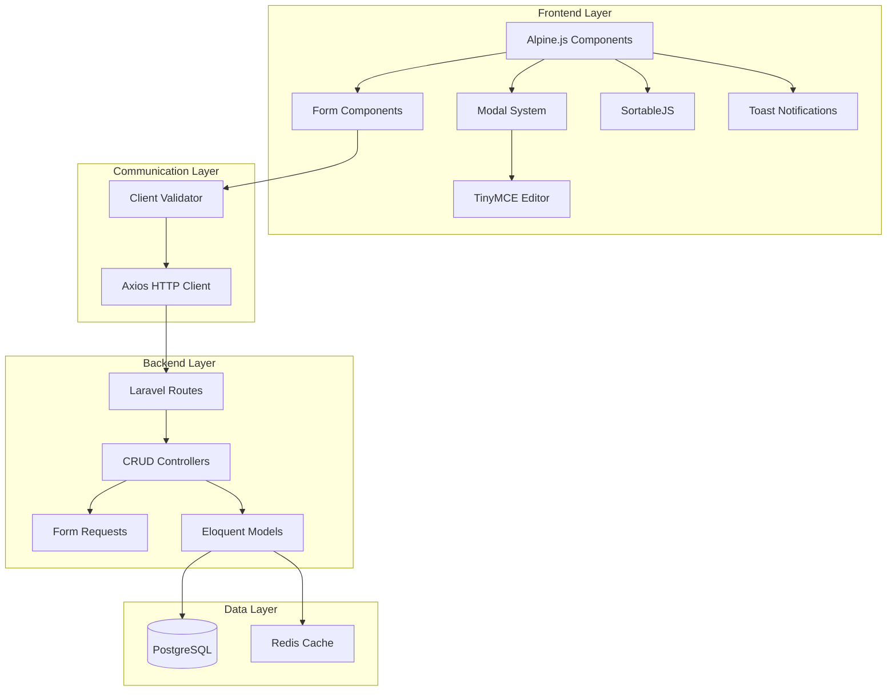

# Technical Design Document: Enhanced Public Page CRUD

## Overview

This document provides a comprehensive technical design for enhancing the unified public page management interface at `/admin/public-page` with robust inline CRUD functionality. The enhancement transforms the current basic tabbed interface into a fully interactive, modal-based management system with real-time updates, drag-and-drop reordering, rich text editing, and comprehensive validation.

### Goals

1. **Eliminate Navigation Overhead**: Replace separate create/edit pages with inline modals
2. **Real-Time Updates**: Implement AJAX-based operations without page reloads
3. **Enhanced User Experience**: Provide immediate feedback, validation, and visual indicators
4. **Accessibility**: Ensure WCAG 2.1 AA compliance with keyboard navigation and screen reader support
5. **Mobile Responsiveness**: Deliver a seamless experience across all device sizes
6. **Maintainability**: Create reusable components and follow Laravel/Alpine.js best practices

### Scope

**In Scope:**
- Inline CRUD modals for Site Pages, Content Blocks, and Navigation Menus
- Rich text editor integration (TinyMCE)
- Drag-and-drop reordering (SortableJS)
- Client and server-side validation
- Toast notification system
- Loading states and error handling
- Accessibility features
- Mobile responsive design

**Out of Scope:**
- Multi-language support (future enhancement)
- Version history/rollback (future enhancement)
- Advanced permissions beyond existing role system
- Real-time collaborative editing

## Architecture

### High-Level Architecture



### Technology Stack

| Layer | Technology | Version | Purpose |
|-------|-----------|---------|---------|
| Backend Framework | Laravel | 10+ | Application framework |
| Template Engine | Blade | Built-in | Server-side rendering |
| Frontend Framework | Alpine.js | 3.x | Reactive UI components |
| CSS Framework | Tailwind CSS | 4.0 | Utility-first styling |
| HTTP Client | Axios | 1.8+ | AJAX requests |
| Rich Text Editor | TinyMCE | 6.x | WYSIWYG content editing |
| Drag & Drop | SortableJS | 1.15+ | Reordering interface |
| Icons | Heroicons | 2.x | UI icons |
| Database | PostgreSQL | 13+ | Data persistence |
| Cache | Redis | 6+ | Performance optimization |

### Component Architecture

The system follows a modular component architecture with clear separation of concerns:

**Frontend Components:**
- `ModalManager`: Centralized modal state management
- `FormValidator`: Client-side validation logic
- `ToastNotifier`: Notification queue system
- `AjaxService`: HTTP request wrapper with error handling
- `RichTextEditor`: TinyMCE integration wrapper
- `DragDropManager`: SortableJS integration wrapper

**Backend Components:**
- `SitePageController`: Site pages CRUD operations
- `ContentBlockController`: Content blocks CRUD operations
- `NavigationMenuController`: Navigation menus CRUD operations
- `NavigationMenuItemController`: Menu items CRUD operations
- Form Request classes for validation
- Resource classes for API responses

## Components and Interfaces

### 1. Modal System

#### Modal Manager Component

**Purpose**: Centralized modal state management using Alpine.js

**Alpine.js Component Structure:**
```javascript
Alpine.data('modalManager', () => ({
    // State
    modals: {},
    activeModal: null,
    unsavedChanges: false,
    
    // Methods
    open(modalId, data = {}) { },
    close(modalId, force = false) { },
    confirmClose(modalId) { },
    trackChanges() { },
    resetChanges() { }
}))
```

**Modal Component Blade Template:**
```blade
<!-- resources/views/components/modal.blade.php -->
<div x-data="{ show: false }"
     x-show="show"
     x-on:open-modal.window="if ($event.detail.id === '{{ $id }}') show = true"
     x-on:close-modal.window="if ($event.detail.id === '{{ $id }}') show = false"
     x-on:keydown.escape.window="show && $dispatch('close-modal', { id: '{{ $id }}' })"
     x-cloak
     class="fixed inset-0 z-50 overflow-y-auto"
     aria-labelledby="modal-title"
     role="dialog"
     aria-modal="true">
    
    <!-- Backdrop -->
    <div x-show="show"
         x-transition:enter="ease-out duration-300"
         x-transition:enter-start="opacity-0"
         x-transition:enter-end="opacity-100"
         x-transition:leave="ease-in duration-200"
         x-transition:leave-start="opacity-100"
         x-transition:leave-end="opacity-0"
         class="fixed inset-0 bg-gray-900/75 backdrop-blur-sm transition-opacity"
         @click="$dispatch('close-modal', { id: '{{ $id }}' })"></div>
    
    <!-- Modal Panel -->
    <div class="flex min-h-full items-end justify-center p-4 text-center sm:items-center sm:p-0">
        <div x-show="show"
             x-transition:enter="ease-out duration-300"
             x-transition:enter-start="opacity-0 translate-y-4 sm:translate-y-0 sm:scale-95"
             x-transition:enter-end="opacity-100 translate-y-0 sm:scale-100"
             x-transition:leave="ease-in duration-200"
             x-transition:leave-start="opacity-100 translate-y-0 sm:scale-100"
             x-transition:leave-end="opacity-0 translate-y-4 sm:translate-y-0 sm:scale-95"
             x-trap.noescape="show"
             @click.stop
             class="relative transform overflow-hidden rounded-lg bg-white text-left shadow-xl transition-all sm:my-8 {{ $width ?? 'sm:max-w-2xl' }} sm:w-full">
            {{ $slot }}
        </div>
    </div>
</div>
```

**Modal Features:**
- Backdrop click to close (with unsaved changes warning)
- Escape key to close
- Focus trap when open
- Smooth transitions
- Responsive sizing (full-screen on mobile)
- ARIA attributes for accessibility

### 2. Form Components

#### Form Validator Component

**Purpose**: Real-time client-side validation with error display

**Alpine.js Component:**
```javascript
Alpine.data('formValidator', (rules) => ({
    fields: {},
    errors: {},
    touched: {},
    isValid: false,
    
    init() {
        this.initializeFields(rules);
    },
    
    validate(fieldName) {
        const field = this.fields[fieldName];
        const rule = rules[fieldName];
        this.errors[fieldName] = this.validateField(field, rule);
        this.updateValidity();
    },
    
    validateAll() {
        Object.keys(this.fields).forEach(field => this.validate(field));
        return this.isValid;
    },
    
    touch(fieldName) {
        this.touched[fieldName] = true;
    }
}))
```

**Validation Rules:**
```javascript
const sitePageRules = {
    title: { required: true, minLength: 3, maxLength: 255 },
    slug: { required: true, pattern: /^[a-z0-9-]+$/, maxLength: 255 },
    content: { required: false },
    status: { required: true, in: ['draft', 'published'] },
    meta_description: { maxLength: 160 }
};
```

#### Form Input Component

**Blade Component:**
```blade
<!-- resources/views/components/form/input.blade.php -->
@props([
    'name',
    'label',
    'type' => 'text',
    'value' => '',
    'required' => false,
    'error' => null,
    'help' => null
])

<div class="mb-4">
    <label for="{{ $name }}" class="block text-sm font-medium text-gray-700 mb-1">
        {{ $label }}
        @if($required)
            <span class="text-red-500">*</span>
        @endif
    </label>
    
    <input type="{{ $type }}"
           id="{{ $name }}"
           name="{{ $name }}"
           value="{{ old($name, $value) }}"
           x-model="fields.{{ $name }}"
           @blur="touch('{{ $name }}'); validate('{{ $name }}')"
           @input="validate('{{ $name }}')"
           {{ $required ? 'required' : '' }}
           {{ $attributes->merge(['class' => 'block w-full rounded-md border-gray-300 shadow-sm focus:border-blue-500 focus:ring-blue-500 sm:text-sm']) }}
           aria-describedby="{{ $name }}-error {{ $name }}-help"
           :aria-invalid="errors.{{ $name }} ? 'true' : 'false'">
    
    @if($error || $help)
        <div class="mt-1">
            @if($error)
                <p class="text-sm text-red-600" id="{{ $name }}-error" role="alert">
                    {{ $error }}
                </p>
            @endif
            @if($help)
                <p class="text-sm text-gray-500" id="{{ $name }}-help">
                    {{ $help }}
                </p>
            @endif
        </div>
    @endif
    
    <div x-show="touched.{{ $name }} && errors.{{ $name }}" 
         x-text="errors.{{ $name }}"
         class="mt-1 text-sm text-red-600"
         role="alert"></div>
</div>
```

### 3. Rich Text Editor Integration

#### TinyMCE Configuration

**Purpose**: Provide WYSIWYG editing for page content and blocks

**Installation:**
```bash
npm install tinymce @tinymce/tinymce-vue
```

**Alpine.js Wrapper Component:**
```javascript
Alpine.data('richTextEditor', (config = {}) => ({
    editor: null,
    content: '',
    
    init() {
        this.initTinyMCE();
    },
    
    initTinyMCE() {
        tinymce.init({
            selector: `#${this.$el.id}`,
            height: config.height || 400,
            menubar: false,
            plugins: [
                'advlist', 'autolink', 'lists', 'link', 'image', 'charmap',
                'preview', 'anchor', 'searchreplace', 'visualblocks', 'code',
                'fullscreen', 'insertdatetime', 'media', 'table', 'help', 'wordcount'
            ],
            toolbar: 'undo redo | blocks | bold italic | alignleft aligncenter alignright | bullist numlist | link image | code',
            content_style: 'body { font-family: -apple-system, BlinkMacSystemFont, "Segoe UI", Roboto, sans-serif; font-size: 14px }',
            images_upload_handler: this.handleImageUpload.bind(this),
            setup: (editor) => {
                this.editor = editor;
                editor.on('change', () => {
                    this.content = editor.getContent();
                    this.$dispatch('content-changed', { content: this.content });
                });
            }
        });
    },
    
    async handleImageUpload(blobInfo, progress) {
        const formData = new FormData();
        formData.append('image', blobInfo.blob(), blobInfo.filename());
        
        try {
            const response = await axios.post('/admin/upload-image', formData, {
                headers: { 'Content-Type': 'multipart/form-data' },
                onUploadProgress: (e) => progress(e.loaded / e.total * 100)
            });
            return response.data.url;
        } catch (error) {
            throw new Error('Image upload failed: ' + error.message);
        }
    },
    
    destroy() {
        if (this.editor) {
            tinymce.remove(this.editor);
        }
    }
}))
```

**TinyMCE Blade Component:**
```blade
<!-- resources/views/components/form/rich-text.blade.php -->
@props([
    'name',
    'label',
    'value' => '',
    'required' => false,
    'height' => 400
])

<div class="mb-4" x-data="richTextEditor({ height: {{ $height }} })">
    <label for="{{ $name }}" class="block text-sm font-medium text-gray-700 mb-1">
        {{ $label }}
        @if($required)
            <span class="text-red-500">*</span>
        @endif
    </label>
    
    <textarea id="{{ $name }}"
              name="{{ $name }}"
              x-model="content"
              class="hidden">{{ old($name, $value) }}</textarea>
    
    <div x-show="touched.{{ $name }} && errors.{{ $name }}" 
         x-text="errors.{{ $name }}"
         class="mt-1 text-sm text-red-600"
         role="alert"></div>
</div>

@push('scripts')
<script src="https://cdn.tiny.cloud/1/YOUR_API_KEY/tinymce/6/tinymce.min.js" referrerpolicy="origin"></script>
@endpush
```

### 4. Drag-and-Drop System

#### SortableJS Integration

**Purpose**: Enable intuitive reordering of pages, blocks, and menu items

**Installation:**
```bash
npm install sortablejs
```

**Alpine.js Wrapper:**
```javascript
Alpine.data('dragDropManager', (config = {}) => ({
    sortable: null,
    items: [],
    
    init() {
        this.items = config.items || [];
        this.initSortable();
    },
    
    initSortable() {
        this.sortable = Sortable.create(this.$el, {
            animation: 150,
            handle: '.drag-handle',
            ghostClass: 'sortable-ghost',
            dragClass: 'sortable-drag',
            onEnd: (evt) => {
                this.handleReorder(evt);
            }
        });
    },
    
    async handleReorder(evt) {
        const itemId = evt.item.dataset.id;
        const newIndex = evt.newIndex;
        const oldIndex = evt.oldIndex;
        
        // Optimistic update
        const item = this.items.splice(oldIndex, 1)[0];
        this.items.splice(newIndex, 0, item);
        
        try {
            await axios.post(config.reorderUrl, {
                id: itemId,
                position: newIndex,
                items: this.items.map((item, index) => ({
                    id: item.id,
                    order: index
                }))
            });
            
            this.$dispatch('toast', {
                type: 'success',
                message: 'Order updated successfully'
            });
        } catch (error) {
            // Revert on error
            const item = this.items.splice(newIndex, 1)[0];
            this.items.splice(oldIndex, 0, item);
            
            this.$dispatch('toast', {
                type: 'error',
                message: 'Failed to update order'
            });
        }
    }
}))
```

**Sortable List Component:**
```blade
<!-- resources/views/components/sortable-list.blade.php -->
@props(['items', 'reorderUrl'])

<div x-data="dragDropManager({ items: {{ json_encode($items) }}, reorderUrl: '{{ $reorderUrl }}' })"
     class="space-y-2">
    <template x-for="(item, index) in items" :key="item.id">
        <div :data-id="item.id"
             class="flex items-center gap-3 p-4 bg-white rounded-lg border border-gray-200 hover:border-gray-300 transition-colors">
            <!-- Drag Handle -->
            <button type="button"
                    class="drag-handle cursor-move text-gray-400 hover:text-gray-600"
                    aria-label="Drag to reorder">
                <svg class="w-5 h-5" fill="none" stroke="currentColor" viewBox="0 0 24 24">
                    <path stroke-linecap="round" stroke-linejoin="round" stroke-width="2" d="M4 8h16M4 16h16" />
                </svg>
            </button>
            
            <!-- Item Content -->
            <div class="flex-1">
                {{ $slot }}
            </div>
        </div>
    </template>
</div>
```

### 5. Toast Notification System

#### Toast Manager Component

**Purpose**: Display success, error, and informational messages

**Alpine.js Component:**
```javascript
Alpine.data('toastManager', () => ({
    toasts: [],
    nextId: 1,
    
    init() {
        this.$watch('toasts', () => {
            this.announceToScreenReader();
        });
        
        window.addEventListener('toast', (e) => {
            this.show(e.detail);
        });
    },
    
    show({ type = 'info', message, duration = 5000 }) {
        const id = this.nextId++;
        const toast = { id, type, message, duration };
        
        this.toasts.push(toast);
        
        if (duration > 0 && type !== 'error') {
            setTimeout(() => this.remove(id), duration);
        }
    },
    
    remove(id) {
        this.toasts = this.toasts.filter(t => t.id !== id);
    },
    
    announceToScreenReader() {
        const lastToast = this.toasts[this.toasts.length - 1];
        if (lastToast) {
            const announcement = document.createElement('div');
            announcement.setAttribute('role', 'status');
            announcement.setAttribute('aria-live', 'polite');
            announcement.className = 'sr-only';
            announcement.textContent = lastToast.message;
            document.body.appendChild(announcement);
            setTimeout(() => announcement.remove(), 1000);
        }
    }
}))
```

**Toast Component Blade:**
```blade
<!-- resources/views/components/toast-container.blade.php -->
<div x-data="toastManager()"
     class="fixed top-4 right-4 z-50 space-y-2 max-w-sm"
     aria-live="polite"
     aria-atomic="true">
    <template x-for="toast in toasts" :key="toast.id">
        <div x-show="true"
             x-transition:enter="transform ease-out duration-300 transition"
             x-transition:enter-start="translate-y-2 opacity-0 sm:translate-y-0 sm:translate-x-2"
             x-transition:enter-end="translate-y-0 opacity-100 sm:translate-x-0"
             x-transition:leave="transition ease-in duration-100"
             x-transition:leave-start="opacity-100"
             x-transition:leave-end="opacity-0"
             class="pointer-events-auto w-full max-w-sm overflow-hidden rounded-lg shadow-lg ring-1 ring-black ring-opacity-5"
             :class="{
                 'bg-green-50': toast.type === 'success',
                 'bg-red-50': toast.type === 'error',
                 'bg-blue-50': toast.type === 'info',
                 'bg-yellow-50': toast.type === 'warning'
             }">
            <div class="p-4">
                <div class="flex items-start">
                    <!-- Icon -->
                    <div class="flex-shrink-0">
                        <svg x-show="toast.type === 'success'" class="h-6 w-6 text-green-400" fill="none" viewBox="0 0 24 24" stroke="currentColor">
                            <path stroke-linecap="round" stroke-linejoin="round" stroke-width="2" d="M9 12l2 2 4-4m6 2a9 9 0 11-18 0 9 9 0 0118 0z" />
                        </svg>
                        <svg x-show="toast.type === 'error'" class="h-6 w-6 text-red-400" fill="none" viewBox="0 0 24 24" stroke="currentColor">
                            <path stroke-linecap="round" stroke-linejoin="round" stroke-width="2" d="M10 14l2-2m0 0l2-2m-2 2l-2-2m2 2l2 2m7-2a9 9 0 11-18 0 9 9 0 0118 0z" />
                        </svg>
                        <svg x-show="toast.type === 'info'" class="h-6 w-6 text-blue-400" fill="none" viewBox="0 0 24 24" stroke="currentColor">
                            <path stroke-linecap="round" stroke-linejoin="round" stroke-width="2" d="M13 16h-1v-4h-1m1-4h.01M21 12a9 9 0 11-18 0 9 9 0 0118 0z" />
                        </svg>
                    </div>
                    
                    <!-- Message -->
                    <div class="ml-3 w-0 flex-1 pt-0.5">
                        <p class="text-sm font-medium"
                           :class="{
                               'text-green-800': toast.type === 'success',
                               'text-red-800': toast.type === 'error',
                               'text-blue-800': toast.type === 'info'
                           }"
                           x-text="toast.message"></p>
                    </div>
                    
                    <!-- Close Button -->
                    <div class="ml-4 flex flex-shrink-0">
                        <button @click="remove(toast.id)"
                                class="inline-flex rounded-md focus:outline-none focus:ring-2 focus:ring-offset-2"
                                :class="{
                                    'text-green-400 hover:text-green-500 focus:ring-green-500': toast.type === 'success',
                                    'text-red-400 hover:text-red-500 focus:ring-red-500': toast.type === 'error',
                                    'text-blue-400 hover:text-blue-500 focus:ring-blue-500': toast.type === 'info'
                                }">
                            <span class="sr-only">Close</span>
                            <svg class="h-5 w-5" viewBox="0 0 20 20" fill="currentColor">
                                <path fill-rule="evenodd" d="M4.293 4.293a1 1 0 011.414 0L10 8.586l4.293-4.293a1 1 0 111.414 1.414L11.414 10l4.293 4.293a1 1 0 01-1.414 1.414L10 11.414l-4.293 4.293a1 1 0 01-1.414-1.414L8.586 10 4.293 5.707a1 1 0 010-1.414z" clip-rule="evenodd" />
                            </svg>
                        </button>
                    </div>
                </div>
            </div>
        </div>
    </template>
</div>
```

### 6. AJAX Service Layer

#### Centralized HTTP Client

**Purpose**: Standardize AJAX requests with error handling and loading states

**JavaScript Service:**
```javascript
// resources/js/services/ajax-service.js
class AjaxService {
    constructor() {
        this.axios = axios.create({
            headers: {
                'X-Requested-With': 'XMLHttpRequest',
                'X-CSRF-TOKEN': document.querySelector('meta[name="csrf-token"]').content
            }
        });
        
        this.setupInterceptors();
    }
    
    setupInterceptors() {
        this.axios.interceptors.response.use(
            response => response,
            error => this.handleError(error)
        );
    }
    
    handleError(error) {
        if (error.response) {
            switch (error.response.status) {
                case 422:
                    return Promise.reject({
                        type: 'validation',
                        errors: error.response.data.errors
                    });
                case 403:
                    window.dispatchEvent(new CustomEvent('toast', {
                        detail: {
                            type: 'error',
                            message: 'You do not have permission to perform this action'
                        }
                    }));
                    break;
                case 404:
                    window.dispatchEvent(new CustomEvent('toast', {
                        detail: {
                            type: 'error',
                            message: 'Resource not found'
                        }
                    }));
                    break;
                case 500:
                    window.dispatchEvent(new CustomEvent('toast', {
                        detail: {
                            type: 'error',
                            message: 'Server error. Please try again or contact support.'
                        }
                    }));
                    break;
            }
        } else if (error.request) {
            window.dispatchEvent(new CustomEvent('toast', {
                detail: {
                    type: 'error',
                    message: 'Network error. Please check your connection.'
                }
            }));
        }
        
        return Promise.reject(error);
    }
    
    async get(url, config = {}) {
        return this.axios.get(url, config);
    }
    
    async post(url, data, config = {}) {
        return this.axios.post(url, data, config);
    }
    
    async put(url, data, config = {}) {
        return this.axios.put(url, data, config);
    }
    
    async delete(url, config = {}) {
        return this.axios.delete(url, config);
    }
}

window.ajaxService = new AjaxService();
```

## Data Models

### Database Schema

#### Site Pages Table

```sql
CREATE TABLE site_pages (
    id UUID PRIMARY KEY,
    slug VARCHAR(255) UNIQUE NOT NULL,
    title VARCHAR(255) NOT NULL,
    content TEXT,
    meta_description VARCHAR(160),
    is_published BOOLEAN DEFAULT FALSE,
    sort_order INTEGER DEFAULT 0,
    created_by UUID REFERENCES users(id),
    updated_by UUID REFERENCES users(id),
    created_at TIMESTAMP,
    updated_at TIMESTAMP,
    
    INDEX idx_published (is_published),
    INDEX idx_sort_order (sort_order)
);
```

**Schema Modifications Needed:**
- Add `meta_description` column
- Add `created_by` and `updated_by` columns for audit trail
- Add indexes for performance

#### Site Content Blocks Table

```sql
CREATE TABLE site_content_blocks (
    id BIGSERIAL PRIMARY KEY,
    key VARCHAR(255) UNIQUE NOT NULL,
    title VARCHAR(255),
    description TEXT,
    content TEXT,
    config JSONB DEFAULT '{}',
    is_active BOOLEAN DEFAULT TRUE,
    sort_order INTEGER DEFAULT 0,
    icon VARCHAR(255) DEFAULT 'fa-cube',
    category VARCHAR(255) DEFAULT 'content',
    created_by UUID REFERENCES users(id),
    updated_by UUID REFERENCES users(id),
    created_at TIMESTAMP,
    updated_at TIMESTAMP,
    
    INDEX idx_active (is_active),
    INDEX idx_sort_order (sort_order),
    INDEX idx_category (category)
);
```

**Schema Modifications Needed:**
- Add `content` column for rich text content
- Add `created_by` and `updated_by` columns

#### Navigation Menus Table

```sql
CREATE TABLE navigation_menus (
    id UUID PRIMARY KEY,
    journal_id UUID REFERENCES journals(id) ON DELETE CASCADE,
    title VARCHAR(255) NOT NULL,
    area_name VARCHAR(255) NOT NULL,
    is_active BOOLEAN DEFAULT TRUE,
    created_at TIMESTAMP,
    updated_at TIMESTAMP,
    
    UNIQUE(journal_id, area_name)
);
```

**No modifications needed** - Current schema is sufficient

#### Navigation Menu Items Table

```sql
CREATE TABLE navigation_menu_items (
    id UUID PRIMARY KEY,
    journal_id UUID REFERENCES journals(id) ON DELETE CASCADE,
    title VARCHAR(255) NOT NULL,
    type VARCHAR(50) NOT NULL, -- 'custom', 'route', 'page'
    url TEXT,
    route_name VARCHAR(255),
    path VARCHAR(255),
    content TEXT,
    related_id UUID,
    icon VARCHAR(255),
    target VARCHAR(50) DEFAULT '_self',
    is_active BOOLEAN DEFAULT TRUE,
    created_at TIMESTAMP,
    updated_at TIMESTAMP
);
```

**No modifications needed** - Current schema is sufficient

#### Navigation Menu Item Assignments Table

```sql
CREATE TABLE navigation_menu_item_assignments (
    id UUID PRIMARY KEY,
    menu_id UUID REFERENCES navigation_menus(id) ON DELETE CASCADE,
    menu_item_id UUID REFERENCES navigation_menu_items(id) ON DELETE CASCADE,
    parent_id UUID REFERENCES navigation_menu_item_assignments(id) ON DELETE CASCADE,
    order INTEGER DEFAULT 0,
    created_at TIMESTAMP,
    updated_at TIMESTAMP,
    
    INDEX idx_menu_order (menu_id, order),
    INDEX idx_parent (parent_id)
);
```

**No modifications needed** - Current schema supports nested menus

### Eloquent Models

#### SitePage Model Enhancements

```php
<?php

namespace App\Models;

use Illuminate\Database\Eloquent\Model;
use Illuminate\Database\Eloquent\Concerns\HasUuids;
use Illuminate\Database\Eloquent\Relations\BelongsTo;

class SitePage extends Model
{
    use HasUuids;

    protected $fillable = [
        'slug',
        'title',
        'content',
        'meta_description',
        'is_published',
        'sort_order',
        'created_by',
        'updated_by',
    ];

    protected $casts = [
        'is_published' => 'boolean',
        'sort_order' => 'integer',
    ];

    // Relationships
    public function creator(): BelongsTo
    {
        return $this->belongsTo(User::class, 'created_by');
    }

    public function updater(): BelongsTo
    {
        return $this->belongsTo(User::class, 'updated_by');
    }

    // Scopes
    public function scopePublished($query)
    {
        return $query->where('is_published', true);
    }

    public function scopeOrdered($query)
    {
        return $query->orderBy('sort_order', 'asc');
    }

    // Mutators
    public function setSlugAttribute($value)
    {
        $this->attributes['slug'] = $this->generateUniqueSlug($value);
    }

    // Helpers
    protected function generateUniqueSlug($slug)
    {
        $slug = str($slug)->slug()->toString();
        $originalSlug = $slug;
        $count = 1;

        while (static::where('slug', $slug)->where('id', '!=', $this->id ?? null)->exists()) {
            $slug = "{$originalSlug}-{$count}";
            $count++;
        }

        return $slug;
    }

    // Boot
    protected static function boot()
    {
        parent::boot();

        static::creating(function ($model) {
            $model->created_by = auth()->id();
            $model->updated_by = auth()->id();
        });

        static::updating(function ($model) {
            $model->updated_by = auth()->id();
        });
    }
}
```

## API Endpoints

### RESTful API Design

#### Site Pages Endpoints

| Method | Endpoint | Purpose | Request Body | Response |
|--------|----------|---------|--------------|----------|
| GET | `/admin/api/site-pages` | List all pages | - | `{ data: [pages], meta: {...} }` |
| POST | `/admin/api/site-pages` | Create page | `{ title, slug, content, is_published, meta_description }` | `{ data: page, message }` |
| GET | `/admin/api/site-pages/{id}` | Get single page | - | `{ data: page }` |
| PUT | `/admin/api/site-pages/{id}` | Update page | `{ title, slug, content, is_published, meta_description }` | `{ data: page, message }` |
| DELETE | `/admin/api/site-pages/{id}` | Delete page | - | `{ message }` |
| POST | `/admin/api/site-pages/{id}/duplicate` | Duplicate page | - | `{ data: page, message }` |
| POST | `/admin/api/site-pages/reorder` | Reorder pages | `{ items: [{id, order}] }` | `{ message }` |
| POST | `/admin/api/site-pages/bulk-delete` | Delete multiple | `{ ids: [id1, id2] }` | `{ message, deleted_count }` |

#### Content Blocks Endpoints

| Method | Endpoint | Purpose | Request Body | Response |
|--------|----------|---------|--------------|----------|
| GET | `/admin/api/content-blocks` | List all blocks | - | `{ data: [blocks], meta: {...} }` |
| POST | `/admin/api/content-blocks` | Create block | `{ key, title, content, config, is_active, category }` | `{ data: block, message }` |
| GET | `/admin/api/content-blocks/{id}` | Get single block | - | `{ data: block }` |
| PUT | `/admin/api/content-blocks/{id}` | Update block | `{ title, content, config, is_active }` | `{ data: block, message }` |
| DELETE | `/admin/api/content-blocks/{id}` | Delete block | - | `{ message }` |
| POST | `/admin/api/content-blocks/reorder` | Reorder blocks | `{ items: [{id, order}] }` | `{ message }` |

#### Navigation Menu Endpoints

| Method | Endpoint | Purpose | Request Body | Response |
|--------|----------|---------|--------------|----------|
| GET | `/admin/api/navigation-menus` | List all menus | - | `{ data: [menus] }` |
| POST | `/admin/api/navigation-menus` | Create menu | `{ title, area_name, is_active }` | `{ data: menu, message }` |
| GET | `/admin/api/navigation-menus/{id}` | Get menu with items | - | `{ data: menu }` |
| PUT | `/admin/api/navigation-menus/{id}` | Update menu | `{ title, is_active }` | `{ data: menu, message }` |
| DELETE | `/admin/api/navigation-menus/{id}` | Delete menu | - | `{ message }` |

#### Navigation Menu Items Endpoints

| Method | Endpoint | Purpose | Request Body | Response |
|--------|----------|---------|--------------|----------|
| POST | `/admin/api/navigation-menus/{menuId}/items` | Create menu item | `{ title, type, url, icon, target }` | `{ data: item, message }` |
| PUT | `/admin/api/navigation-menu-items/{id}` | Update menu item | `{ title, type, url, icon, target }` | `{ data: item, message }` |
| DELETE | `/admin/api/navigation-menu-items/{id}` | Delete menu item | - | `{ message }` |
| POST | `/admin/api/navigation-menus/{menuId}/reorder` | Reorder menu items | `{ items: [{id, order, parent_id}] }` | `{ message }` |

#### Image Upload Endpoint

| Method | Endpoint | Purpose | Request Body | Response |
|--------|----------|---------|--------------|----------|
| POST | `/admin/api/upload-image` | Upload image for editor | `multipart/form-data: { image }` | `{ url, filename, size }` |

### Laravel Routes Definition

```php
// routes/web.php

Route::middleware(['auth', 'admin'])->prefix('admin/api')->name('admin.api.')->group(function () {
    
    // Site Pages
    Route::apiResource('site-pages', SitePageController::class);
    Route::post('site-pages/{page}/duplicate', [SitePageController::class, 'duplicate'])->name('site-pages.duplicate');
    Route::post('site-pages/reorder', [SitePageController::class, 'reorder'])->name('site-pages.reorder');
    Route::post('site-pages/bulk-delete', [SitePageController::class, 'bulkDelete'])->name('site-pages.bulk-delete');
    
    // Content Blocks
    Route::apiResource('content-blocks', ContentBlockController::class);
    Route::post('content-blocks/reorder', [ContentBlockController::class, 'reorder'])->name('content-blocks.reorder');
    
    // Navigation Menus
    Route::apiResource('navigation-menus', NavigationMenuController::class);
    Route::post('navigation-menus/{menu}/items', [NavigationMenuItemController::class, 'store'])->name('navigation-menus.items.store');
    Route::post('navigation-menus/{menu}/reorder', [NavigationMenuController::class, 'reorder'])->name('navigation-menus.reorder');
    
    // Navigation Menu Items
    Route::put('navigation-menu-items/{item}', [NavigationMenuItemController::class, 'update'])->name('navigation-menu-items.update');
    Route::delete('navigation-menu-items/{item}', [NavigationMenuItemController::class, 'destroy'])->name('navigation-menu-items.destroy');
    
    // Image Upload
    Route::post('upload-image', [ImageUploadController::class, 'store'])->name('upload-image');
});
```

### Controller Implementation Examples

#### SitePageController

```php
<?php

namespace App\Http\Controllers\Admin\Api;

use App\Http\Controllers\Controller;
use App\Http\Requests\SitePageRequest;
use App\Http\Resources\SitePageResource;
use App\Models\SitePage;
use Illuminate\Http\JsonResponse;
use Illuminate\Http\Request;

class SitePageController extends Controller
{
    public function index(Request $request): JsonResponse
    {
        $query = SitePage::query()->with(['creator', 'updater']);
        
        // Search
        if ($request->has('search')) {
            $search = $request->input('search');
            $query->where(function ($q) use ($search) {
                $q->where('title', 'ILIKE', "%{$search}%")
                  ->orWhere('slug', 'ILIKE', "%{$search}%")
                  ->orWhere('content', 'ILIKE', "%{$search}%");
            });
        }
        
        // Filter by status
        if ($request->has('status')) {
            $query->where('is_published', $request->input('status') === 'published');
        }
        
        // Sort
        $query->ordered();
        
        // Paginate
        $pages = $query->paginate($request->input('per_page', 25));
        
        return response()->json([
            'data' => SitePageResource::collection($pages),
            'meta' => [
                'current_page' => $pages->currentPage(),
                'last_page' => $pages->lastPage(),
                'per_page' => $pages->perPage(),
                'total' => $pages->total(),
            ]
        ]);
    }
    
    public function store(SitePageRequest $request): JsonResponse
    {
        $page = SitePage::create($request->validated());
        
        return response()->json([
            'data' => new SitePageResource($page),
            'message' => 'Page created successfully'
        ], 201);
    }
    
    public function show(SitePage $page): JsonResponse
    {
        return response()->json([
            'data' => new SitePageResource($page->load(['creator', 'updater']))
        ]);
    }
    
    public function update(SitePageRequest $request, SitePage $page): JsonResponse
    {
        $page->update($request->validated());
        
        return response()->json([
            'data' => new SitePageResource($page->fresh()),
            'message' => 'Page updated successfully'
        ]);
    }
    
    public function destroy(SitePage $page): JsonResponse
    {
        $page->delete();
        
        return response()->json([
            'message' => 'Page deleted successfully'
        ]);
    }
    
    public function duplicate(SitePage $page): JsonResponse
    {
        $newPage = $page->replicate();
        $newPage->title = $page->title . ' (Copy)';
        $newPage->slug = null; // Will be auto-generated
        $newPage->is_published = false;
        $newPage->save();
        
        return response()->json([
            'data' => new SitePageResource($newPage),
            'message' => 'Page duplicated successfully'
        ], 201);
    }
    
    public function reorder(Request $request): JsonResponse
    {
        $request->validate([
            'items' => 'required|array',
            'items.*.id' => 'required|exists:site_pages,id',
            'items.*.order' => 'required|integer|min:0'
        ]);
        
        foreach ($request->input('items') as $item) {
            SitePage::where('id', $item['id'])->update(['sort_order' => $item['order']]);
        }
        
        return response()->json([
            'message' => 'Pages reordered successfully'
        ]);
    }
    
    public function bulkDelete(Request $request): JsonResponse
    {
        $request->validate([
            'ids' => 'required|array',
            'ids.*' => 'exists:site_pages,id'
        ]);
        
        $count = SitePage::whereIn('id', $request->input('ids'))->delete();
        
        return response()->json([
            'message' => "{$count} pages deleted successfully",
            'deleted_count' => $count
        ]);
    }
}
```

### Form Request Validation

#### SitePageRequest

```php
<?php

namespace App\Http\Requests;

use Illuminate\Foundation\Http\FormRequest;
use Illuminate\Validation\Rule;

class SitePageRequest extends FormRequest
{
    public function authorize(): bool
    {
        return $this->user()->can('manage-site-pages');
    }
    
    public function rules(): array
    {
        $pageId = $this->route('page')?->id;
        
        return [
            'title' => ['required', 'string', 'min:3', 'max:255'],
            'slug' => [
                'required',
                'string',
                'max:255',
                'regex:/^[a-z0-9-]+$/',
                Rule::unique('site_pages', 'slug')->ignore($pageId)
            ],
            'content' => ['nullable', 'string'],
            'meta_description' => ['nullable', 'string', 'max:160'],
            'is_published' => ['required', 'boolean'],
            'sort_order' => ['nullable', 'integer', 'min:0']
        ];
    }
    
    public function messages(): array
    {
        return [
            'title.required' => 'Page title is required',
            'title.min' => 'Page title must be at least 3 characters',
            'slug.required' => 'Page slug is required',
            'slug.regex' => 'Slug can only contain lowercase letters, numbers, and hyphens',
            'slug.unique' => 'This slug is already in use. Try: :suggestion',
            'meta_description.max' => 'Meta description should not exceed 160 characters for optimal SEO'
        ];
    }
    
    protected function prepareForValidation(): void
    {
        // Auto-generate slug from title if not provided
        if (!$this->has('slug') && $this->has('title')) {
            $this->merge([
                'slug' => str($this->input('title'))->slug()->toString()
            ]);
        }
    }
}
```

#### ContentBlockRequest

```php
<?php

namespace App\Http\Requests;

use Illuminate\Foundation\Http\FormRequest;
use Illuminate\Validation\Rule;

class ContentBlockRequest extends FormRequest
{
    public function authorize(): bool
    {
        return $this->user()->can('manage-content-blocks');
    }
    
    public function rules(): array
    {
        $blockId = $this->route('block')?->id;
        
        return [
            'key' => [
                'required',
                'string',
                'max:255',
                'regex:/^[a-z0-9_]+$/',
                Rule::unique('site_content_blocks', 'key')->ignore($blockId)
            ],
            'title' => ['required', 'string', 'max:255'],
            'description' => ['nullable', 'string'],
            'content' => ['nullable', 'string'],
            'config' => ['nullable', 'array'],
            'is_active' => ['required', 'boolean'],
            'sort_order' => ['nullable', 'integer', 'min:0'],
            'icon' => ['nullable', 'string', 'max:255'],
            'category' => ['required', 'string', 'in:hero,content,features,journals,stats,cta']
        ];
    }
}
```

### API Resource Classes

#### SitePageResource

```php
<?php

namespace App\Http\Resources;

use Illuminate\Http\Resources\Json\JsonResource;

class SitePageResource extends JsonResource
{
    public function toArray($request): array
    {
        return [
            'id' => $this->id,
            'title' => $this->title,
            'slug' => $this->slug,
            'content' => $this->content,
            'meta_description' => $this->meta_description,
            'is_published' => $this->is_published,
            'sort_order' => $this->sort_order,
            'created_at' => $this->created_at?->toIso8601String(),
            'updated_at' => $this->updated_at?->toIso8601String(),
            'created_by' => [
                'id' => $this->creator?->id,
                'name' => $this->creator?->name,
            ],
            'updated_by' => [
                'id' => $this->updater?->id,
                'name' => $this->updater?->name,
            ],
            'created_at_human' => $this->created_at?->diffForHumans(),
            'updated_at_human' => $this->updated_at?->diffForHumans(),
        ];
    }
}
```

## Error Handling

### Error Response Format

All API errors follow a consistent format:

```json
{
    "message": "The given data was invalid.",
    "errors": {
        "field_name": [
            "Error message 1",
            "Error message 2"
        ]
    }
}
```

### HTTP Status Codes

| Code | Meaning | Usage |
|------|---------|-------|
| 200 | OK | Successful GET, PUT requests |
| 201 | Created | Successful POST requests |
| 204 | No Content | Successful DELETE requests |
| 400 | Bad Request | Malformed request |
| 401 | Unauthorized | Not authenticated |
| 403 | Forbidden | Authenticated but not authorized |
| 404 | Not Found | Resource doesn't exist |
| 422 | Unprocessable Entity | Validation errors |
| 500 | Internal Server Error | Server-side errors |

### Error Handling Strategy

**Client-Side:**
1. Display validation errors inline next to form fields
2. Show toast notifications for operation failures
3. Provide retry mechanisms for network errors
4. Maintain form state on errors

**Server-Side:**
1. Use Form Requests for validation
2. Return structured error responses
3. Log errors for debugging
4. Provide helpful error messages

## Testing Strategy

### Unit Tests

**Models:**
- Test slug auto-generation and uniqueness
- Test audit trail (created_by, updated_by)
- Test scopes and relationships
- Test mutators and accessors

**Form Requests:**
- Test validation rules
- Test authorization logic
- Test custom validation messages
- Test data preparation

**Example:**
```php
public function test_site_page_generates_unique_slug()
{
    $page1 = SitePage::factory()->create(['slug' => 'about-us']);
    $page2 = new SitePage(['title' => 'About Us', 'slug' => 'about-us']);
    $page2->save();
    
    $this->assertEquals('about-us-1', $page2->slug);
}
```

### Feature Tests

**API Endpoints:**
- Test CRUD operations
- Test authentication and authorization
- Test validation errors
- Test pagination and filtering
- Test bulk operations

**Example:**
```php
public function test_can_create_site_page()
{
    $user = User::factory()->admin()->create();
    
    $response = $this->actingAs($user)
        ->postJson('/admin/api/site-pages', [
            'title' => 'Test Page',
            'slug' => 'test-page',
            'content' => '<p>Test content</p>',
            'is_published' => true
        ]);
    
    $response->assertStatus(201)
        ->assertJsonStructure(['data', 'message']);
    
    $this->assertDatabaseHas('site_pages', [
        'title' => 'Test Page',
        'slug' => 'test-page'
    ]);
}
```

### Integration Tests

**Modal System:**
- Test modal open/close
- Test unsaved changes warning
- Test focus management
- Test keyboard navigation

**Drag-and-Drop:**
- Test reordering functionality
- Test optimistic updates
- Test error rollback

**Rich Text Editor:**
- Test initialization
- Test content updates
- Test image upload
- Test cleanup on destroy

### Browser Tests (Dusk)

**End-to-End Workflows:**
- Create page with rich text content
- Edit page and save changes
- Delete page with confirmation
- Reorder pages via drag-and-drop
- Bulk delete multiple pages

**Accessibility:**
- Test keyboard navigation
- Test screen reader announcements
- Test focus management
- Test ARIA attributes

**Example:**
```php
public function test_can_create_page_via_modal()
{
    $this->browse(function (Browser $browser) {
        $browser->loginAs(User::factory()->admin()->create())
            ->visit('/admin/public-page')
            ->click('@create-page-button')
            ->waitFor('@page-modal')
            ->type('title', 'New Page')
            ->type('slug', 'new-page')
            ->tinymce('content', '<p>Page content</p>')
            ->click('@save-button')
            ->waitForText('Page created successfully')
            ->assertSee('New Page');
    });
}
```

### Performance Tests

**Load Testing:**
- Test with 1000+ pages
- Test pagination performance
- Test search performance
- Test concurrent updates

**Caching:**
- Test cache invalidation
- Test cache hit rates
- Test Redis performance

## Accessibility

### WCAG 2.1 AA Compliance

**Keyboard Navigation:**
- All interactive elements accessible via Tab key
- Modal focus trap
- Escape key to close modals
- Arrow keys for tab navigation
- Enter/Space to activate buttons

**Screen Reader Support:**
- ARIA labels on all form fields
- ARIA live regions for toast notifications
- ARIA attributes on modals (role, aria-modal, aria-labelledby)
- Status announcements for dynamic content

**Visual Accessibility:**
- Sufficient color contrast (4.5:1 for text)
- Focus indicators on all interactive elements
- Error messages associated with form fields
- Loading states clearly indicated

**Implementation Checklist:**
- [ ] All buttons have accessible labels
- [ ] Form fields have associated labels
- [ ] Error messages use aria-describedby
- [ ] Modals trap focus and restore on close
- [ ] Toast notifications announced to screen readers
- [ ] Drag handles have keyboard alternatives
- [ ] Skip links for main content
- [ ] Heading hierarchy is logical

## Mobile Responsive Design

### Breakpoints

| Breakpoint | Width | Layout Changes |
|------------|-------|----------------|
| Mobile | < 640px | Full-screen modals, stacked forms, touch-optimized buttons |
| Tablet | 640px - 1024px | Slide-over modals, 2-column forms |
| Desktop | > 1024px | Centered modals, multi-column layouts |

### Mobile Optimizations

**Modals:**
- Full-screen on mobile (< 768px)
- Slide-up animation
- Fixed header with close button
- Scrollable content area

**Forms:**
- Vertical field stacking
- Larger touch targets (44x44px minimum)
- Mobile-optimized keyboard types
- Simplified rich text toolbar

**Drag-and-Drop:**
- Touch gesture support
- Visual feedback for touch interactions
- Alternative reorder buttons for accessibility

**Tables:**
- Responsive card layout on mobile
- Horizontal scroll for wide tables
- Sticky headers

### Touch Interactions

```javascript
// Touch-friendly drag-and-drop
Sortable.create(element, {
    touchStartThreshold: 10,
    delay: 100,
    delayOnTouchOnly: true,
    forceFallback: true
});
```

## Security Considerations

### Authentication & Authorization

**Middleware:**
```php
Route::middleware(['auth', 'can:manage-site-pages'])->group(function () {
    // Protected routes
});
```

**Policy-Based Authorization:**
```php
class SitePagePolicy
{
    public function create(User $user): bool
    {
        return $user->hasRole(['super-admin', 'site-admin']);
    }
    
    public function update(User $user, SitePage $page): bool
    {
        return $user->hasRole(['super-admin', 'site-admin']);
    }
    
    public function delete(User $user, SitePage $page): bool
    {
        return $user->hasRole(['super-admin', 'site-admin']);
    }
}
```

### Input Sanitization

**Rich Text Content:**
- Use HTMLPurifier for sanitization
- Whitelist allowed HTML tags
- Strip dangerous attributes (onclick, onerror)
- Validate image URLs

```php
use HTMLPurifier;
use HTMLPurifier_Config;

public function sanitizeContent(string $content): string
{
    $config = HTMLPurifier_Config::createDefault();
    $config->set('HTML.Allowed', 'p,br,strong,em,u,h1,h2,h3,h4,ul,ol,li,a[href],img[src|alt]');
    $config->set('AutoFormat.RemoveEmpty', true);
    
    $purifier = new HTMLPurifier($config);
    return $purifier->purify($content);
}
```

### CSRF Protection

- All POST/PUT/DELETE requests include CSRF token
- Token automatically included in Axios headers
- Token validation on server-side

### XSS Prevention

- Escape output in Blade templates
- Sanitize rich text content
- Use Content Security Policy headers

### SQL Injection Prevention

- Use Eloquent ORM (parameterized queries)
- Validate all input
- Use prepared statements

### File Upload Security

**Image Upload Validation:**
```php
public function store(Request $request)
{
    $request->validate([
        'image' => [
            'required',
            'image',
            'mimes:jpeg,png,gif,webp',
            'max:5120', // 5MB
            'dimensions:max_width=4000,max_height=4000'
        ]
    ]);
    
    $path = $request->file('image')->store('images', 'public');
    
    return response()->json([
        'url' => Storage::url($path),
        'filename' => basename($path)
    ]);
}
```

## Performance Optimization

### Database Optimization

**Indexes:**
```sql
CREATE INDEX idx_site_pages_published ON site_pages(is_published);
CREATE INDEX idx_site_pages_sort_order ON site_pages(sort_order);
CREATE INDEX idx_content_blocks_active ON site_content_blocks(is_active);
CREATE INDEX idx_content_blocks_sort_order ON site_content_blocks(sort_order);
```

**Eager Loading:**
```php
$pages = SitePage::with(['creator', 'updater'])->get();
```

**Query Optimization:**
```php
// Use select to limit columns
$pages = SitePage::select(['id', 'title', 'slug', 'is_published'])->get();

// Use pagination for large datasets
$pages = SitePage::paginate(25);
```

### Caching Strategy

**Cache Active Blocks:**
```php
$blocks = Cache::remember('site_content_blocks_active', 3600, function () {
    return SiteContentBlock::active()->ordered()->get();
});
```

**Cache Invalidation:**
```php
protected static function boot()
{
    parent::boot();
    
    static::saved(function ($model) {
        Cache::forget('site_content_blocks_active');
    });
}
```

### Frontend Optimization

**Lazy Loading:**
- Load TinyMCE only when modal opens
- Lazy load images in content
- Code splitting for large components

**Debouncing:**
```javascript
// Debounce search input
const debouncedSearch = debounce((query) => {
    this.search(query);
}, 300);
```

**Asset Optimization:**
- Minify JavaScript and CSS
- Use Vite for bundling
- Enable gzip compression
- Use CDN for static assets

## Implementation Guidelines

### Development Phases

**Phase 1: Foundation (Week 1-2)**
1. Database migrations for schema modifications
2. Update Eloquent models with audit trail
3. Create base API controllers and routes
4. Implement Form Request validation
5. Create API Resource classes

**Phase 2: Frontend Components (Week 2-3)**
1. Modal system component
2. Form validator component
3. Toast notification system
4. AJAX service layer
5. Reusable form components

**Phase 3: Rich Text & Drag-Drop (Week 3-4)**
1. TinyMCE integration
2. Image upload functionality
3. SortableJS integration
4. Drag-drop manager component

**Phase 4: Site Pages CRUD (Week 4-5)**
1. Create page modal
2. Edit page modal
3. Delete confirmation
4. Bulk operations
5. Search and filter

**Phase 5: Content Blocks CRUD (Week 5-6)**
1. Create block modal
2. Edit block modal
3. Drag-drop reordering
4. Live preview

**Phase 6: Navigation CRUD (Week 6-7)**
1. Menu management
2. Menu item CRUD
3. Nested menu support
4. Drag-drop reordering

**Phase 7: Polish & Testing (Week 7-8)**
1. Accessibility audit
2. Mobile responsive testing
3. Performance optimization
4. Browser compatibility testing
5. User acceptance testing

### Code Organization

```
app/
├── Http/
│   ├── Controllers/
│   │   └── Admin/
│   │       └── Api/
│   │           ├── SitePageController.php
│   │           ├── ContentBlockController.php
│   │           ├── NavigationMenuController.php
│   │           ├── NavigationMenuItemController.php
│   │           └── ImageUploadController.php
│   ├── Requests/
│   │   ├── SitePageRequest.php
│   │   ├── ContentBlockRequest.php
│   │   ├── NavigationMenuRequest.php
│   │   └── NavigationMenuItemRequest.php
│   └── Resources/
│       ├── SitePageResource.php
│       ├── ContentBlockResource.php
│       ├── NavigationMenuResource.php
│       └── NavigationMenuItemResource.php
├── Models/
│   ├── SitePage.php (enhanced)
│   ├── SiteContentBlock.php (enhanced)
│   ├── NavigationMenu.php
│   └── NavigationMenuItem.php
└── Policies/
    ├── SitePagePolicy.php
    ├── ContentBlockPolicy.php
    └── NavigationMenuPolicy.php

resources/
├── js/
│   ├── components/
│   │   ├── modal-manager.js
│   │   ├── form-validator.js
│   │   ├── toast-manager.js
│   │   ├── rich-text-editor.js
│   │   └── drag-drop-manager.js
│   └── services/
│       └── ajax-service.js
└── views/
    ├── components/
    │   ├── modal.blade.php
    │   ├── toast-container.blade.php
    │   ├── sortable-list.blade.php
    │   └── form/
    │       ├── input.blade.php
    │       ├── textarea.blade.php
    │       ├── select.blade.php
    │       └── rich-text.blade.php
    └── admin/
        └── public-page/
            ├── index.blade.php (enhanced)
            ├── modals/
            │   ├── site-page-modal.blade.php
            │   ├── content-block-modal.blade.php
            │   ├── navigation-menu-modal.blade.php
            │   └── menu-item-modal.blade.php
            └── partials/
                ├── site-pages.blade.php (enhanced)
                ├── page-builder.blade.php (enhanced)
                └── site-navigation.blade.php (enhanced)

database/
└── migrations/
    ├── 2025_XX_XX_add_audit_fields_to_site_pages.php
    ├── 2025_XX_XX_add_meta_description_to_site_pages.php
    └── 2025_XX_XX_add_content_to_site_content_blocks.php
```

### Coding Standards

**PHP (PSR-12):**
- Use type hints for parameters and return types
- Follow Laravel naming conventions
- Use dependency injection
- Write descriptive method names

**JavaScript (ES6+):**
- Use const/let instead of var
- Use arrow functions
- Use async/await for promises
- Follow Alpine.js conventions

**Blade Templates:**
- Use components for reusable UI
- Keep logic minimal in templates
- Use @props for component parameters
- Follow accessibility best practices

**CSS (Tailwind):**
- Use utility classes
- Create custom components for repeated patterns
- Follow mobile-first approach
- Use Tailwind's responsive prefixes

### Git Workflow

**Branch Strategy:**
- `main` - Production-ready code
- `develop` - Integration branch
- `feature/enhanced-crud-foundation` - Phase 1
- `feature/enhanced-crud-components` - Phase 2
- etc.

**Commit Messages:**
```
feat: Add modal manager component
fix: Resolve validation error display issue
refactor: Extract form validation logic
test: Add unit tests for SitePage model
docs: Update API documentation
```

### Code Review Checklist

- [ ] Code follows PSR-12 and project standards
- [ ] All tests pass
- [ ] No console errors or warnings
- [ ] Accessibility requirements met
- [ ] Mobile responsive
- [ ] Security considerations addressed
- [ ] Performance optimized
- [ ] Documentation updated
- [ ] No hardcoded values
- [ ] Error handling implemented

## Deployment Considerations

### Environment Configuration

**Required Environment Variables:**
```env
# TinyMCE API Key
TINYMCE_API_KEY=your_api_key_here

# Image Upload Settings
MAX_IMAGE_SIZE=5120  # KB
ALLOWED_IMAGE_TYPES=jpeg,png,gif,webp

# Cache Settings
CACHE_DRIVER=redis
CACHE_TTL=3600
```

### Database Migrations

**Migration Execution Order:**
1. Add audit fields to site_pages
2. Add meta_description to site_pages
3. Add content field to site_content_blocks
4. Add indexes for performance

**Rollback Strategy:**
- Each migration has a down() method
- Test rollback in staging environment
- Backup database before production deployment

### Asset Compilation

```bash
# Install dependencies
npm install

# Build for production
npm run build

# Verify build output
ls -la public/build
```

### Cache Warming

```bash
# Clear all caches
php artisan cache:clear
php artisan config:clear
php artisan route:clear
php artisan view:clear

# Warm caches
php artisan config:cache
php artisan route:cache
php artisan view:cache
```

### Deployment Checklist

- [ ] Run database migrations
- [ ] Compile frontend assets
- [ ] Clear and warm caches
- [ ] Test all CRUD operations
- [ ] Verify image upload functionality
- [ ] Test drag-and-drop on production
- [ ] Verify mobile responsiveness
- [ ] Test accessibility features
- [ ] Monitor error logs
- [ ] Verify performance metrics

## Monitoring and Maintenance

### Logging

**Application Logs:**
```php
Log::info('Site page created', [
    'page_id' => $page->id,
    'user_id' => auth()->id()
]);

Log::error('Failed to upload image', [
    'error' => $e->getMessage(),
    'user_id' => auth()->id()
]);
```

**Monitoring Metrics:**
- API response times
- Error rates
- Cache hit rates
- Image upload success rates
- User activity patterns

### Backup Strategy

**Database Backups:**
- Daily automated backups
- Retain for 30 days
- Test restore procedures monthly

**File Backups:**
- Backup uploaded images
- Sync to S3 or similar storage
- Implement versioning

### Maintenance Tasks

**Weekly:**
- Review error logs
- Check performance metrics
- Verify backup integrity

**Monthly:**
- Update dependencies
- Security audit
- Performance optimization review

**Quarterly:**
- Accessibility audit
- User feedback review
- Feature enhancement planning

## Future Enhancements

### Phase 2 Features (Post-Launch)

1. **Version History**
   - Track content changes
   - Restore previous versions
   - Compare versions side-by-side

2. **Multi-Language Support**
   - Translate pages and blocks
   - Language switcher
   - Fallback to default language

3. **Advanced Permissions**
   - Granular role-based access
   - Content approval workflow
   - Draft/review/publish states

4. **Content Scheduling**
   - Schedule publish/unpublish dates
   - Automated content lifecycle
   - Preview scheduled content

5. **SEO Enhancements**
   - Open Graph tags
   - Twitter Card metadata
   - Structured data (JSON-LD)
   - SEO score analysis

6. **Analytics Integration**
   - Page view tracking
   - User engagement metrics
   - A/B testing support

7. **Content Templates**
   - Predefined page templates
   - Block templates
   - Quick start wizards

8. **Media Library**
   - Centralized image management
   - Image editing tools
   - Asset organization

9. **Collaborative Editing**
   - Real-time collaboration
   - Conflict resolution
   - User presence indicators

10. **Advanced Search**
    - Full-text search
    - Faceted filtering
    - Search suggestions

## Conclusion

This technical design provides a comprehensive blueprint for implementing enhanced CRUD functionality in the unified public page management interface. The design emphasizes:

- **User Experience**: Inline modals, real-time updates, and intuitive interactions
- **Accessibility**: WCAG 2.1 AA compliance with keyboard navigation and screen reader support
- **Performance**: Optimized queries, caching, and lazy loading
- **Security**: Input validation, sanitization, and authorization
- **Maintainability**: Modular components, clear separation of concerns, and comprehensive testing

By following this design, the development team can deliver a robust, scalable, and user-friendly content management system that meets all requirements while maintaining code quality and best practices.

### Key Success Metrics

- **Performance**: API response time < 200ms
- **Accessibility**: WCAG 2.1 AA compliance score 100%
- **User Satisfaction**: Task completion rate > 95%
- **Code Quality**: Test coverage > 80%
- **Mobile Experience**: Lighthouse mobile score > 90

### Next Steps

1. Review and approve design document
2. Set up development environment
3. Begin Phase 1 implementation
4. Schedule regular progress reviews
5. Plan user acceptance testing
