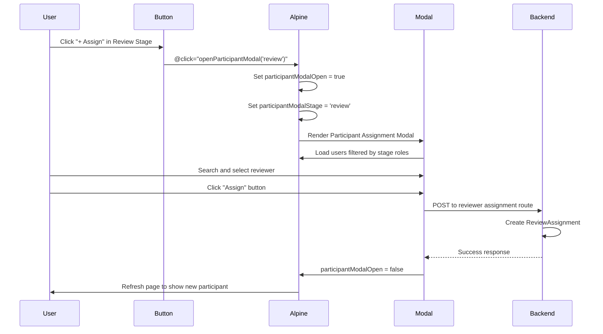

# Design Document: Fix Submission Workflow Modal Bugs

## Overview

This design addresses the modal display bugs in the submission workflow page where "+ Assign" buttons in PARTICIPANTS sections incorrectly open the Editor Assignment modal instead of opening stage-appropriate Participant Assignment modals. The fix involves creating a new Participant Assignment modal component, adding Alpine.js modal control functions, and updating button click handlers to call the correct functions based on workflow stage context.

The solution maintains backward compatibility with existing working modals and follows the established design patterns in the codebase.

## Architecture

### Component Structure

```
Submission Workflow Page (show.blade.php)
├── Alpine.js Component (submissionWorkflow)
│   ├── Modal State Management
│   │   ├── assignEditorModalOpen (existing)
│   │   ├── participantModalOpen (new)
│   │   ├── participantModalStage (new)
│   │   └── Other existing modal states
│   └── Modal Control Functions
│       ├── openAssignEditorModal() (existing)
│       ├── openParticipantModal(stage) (new)
│       └── Other existing modal functions
│
├── Modals (Blade Partials)
│   ├── modal-assign-editor.blade.php (existing)
│   ├── modal-assign-participant.blade.php (new)
│   └── Other existing modals
│
└── Workflow Stage Sections
    ├── Submission Stage
    │   └── "+ Assign" → openAssignEditorModal()
    ├── Review Stage
    │   └── "+ Assign" → openParticipantModal('review')
    ├── Copyediting Stage
    │   └── "+ Assign" → openParticipantModal('copyediting')
    └── Production Stage
        └── "+ Assign" → openParticipantModal('production')
```

### Data Flow



## Components and Interfaces

### 1. Participant Assignment Modal Component

**File:** `resources/views/submissions/partials/modal-assign-participant.blade.php`

**Purpose:** Reusable modal for assigning stage-specific participants (reviewers, copyeditors, production staff)

**Structure:**
```blade
<div x-show="participantModalOpen" x-cloak>
    {{-- Background overlay --}}
    {{-- Modal Panel --}}
    <div>
        {{-- Header with stage-specific title and icon --}}
        {{-- Search input --}}
        {{-- Role filter dropdown --}}
        {{-- User list with selection --}}
        {{-- Footer with Cancel and Assign buttons --}}
    </div>
</div>
```

**Props/Data:**
- `participantModalOpen`: Boolean controlling modal visibility
- `participantModalStage`: String ('review', 'copyediting', 'production')
- `participantSearch`: String for filtering users
- `participantRoleFilter`: String for role-based filtering
- `selectedParticipant`: Object containing selected user data
- `availableParticipants`: Array of users eligible for assignment

**Stage-Specific Configuration:**

```php
// Stage → Route mapping
$stageRoutes = [
    'review' => route('journal.workflow.assign-reviewer', [...]),
    'copyediting' => route('journal.workflow.assign-copyeditor', [...]),
    'production' => route('journal.workflow.assign-production', [...])
];

// Stage → Modal title mapping
$stageTitles = [
    'review' => ['en' => 'Assign Reviewer', 'id' => 'Tugaskan Reviewer'],
    'copyediting' => ['en' => 'Assign Copyeditor', 'id' => 'Tugaskan Copyeditor'],
    'production' => ['en' => 'Assign Production Staff', 'id' => 'Tugaskan Staf Produksi']
];

// Stage → Role filter options
$stageRoles = [
    'review' => ['Reviewer'],
    'copyediting' => ['Copyeditor', 'Layout Editor'],
    'production' => ['Layout Editor', 'Proofreader']
];
```

### 2. Alpine.js Component Updates

**File:** `resources/views/submissions/show.blade.php` (lines 6139-6985)

**New State Variables:**
```javascript
// Participant Assignment Modal State
participantModalOpen: false,
participantModalStage: null,
participantSearch: '',
participantRoleFilter: '',
allParticipants: config.potentialParticipants || {},
selectedParticipant: null,
```

**New Functions:**
```javascript
openParticipantModal(stage) {
    this.participantModalStage = stage;
    this.resetParticipantModal();
    this.participantModalOpen = true;
},

resetParticipantModal() {
    this.selectedParticipant = null;
    this.participantSearch = '';
    this.participantRoleFilter = this.getDefaultRoleFilter(this.participantModalStage);
},

getDefaultRoleFilter(stage) {
    const defaults = {
        'review': 'Reviewer',
        'copyediting': 'Copyeditor',
        'production': 'Layout Editor'
    };
    return defaults[stage] || '';
},

selectParticipant(participant) {
    this.selectedParticipant = participant;
},

get filteredParticipants() {
    let participants = this.getParticipantsForStage(this.participantModalStage);
    
    // Convert object to array if needed
    if (participants && typeof participants === 'object' && !Array.isArray(participants)) {
        participants = Object.values(participants);
    }
    
    if (!Array.isArray(participants)) {
        return [];
    }
    
    // Text search filter
    if (this.participantSearch) {
        const search = this.participantSearch.toLowerCase();
        participants = participants.filter(p => {
            const name = (p.name || '').toLowerCase();
            const email = (p.email || '').toLowerCase();
            return name.includes(search) || email.includes(search);
        });
    }
    
    // Role filter
    if (this.participantRoleFilter) {
        const filterVal = this.participantRoleFilter.toLowerCase();
        participants = participants.filter(p =>
            p.role_names && Array.isArray(p.role_names) && 
            p.role_names.some(role => role && role.toLowerCase().includes(filterVal))
        );
    }
    
    return participants;
},

getParticipantsForStage(stage) {
    // Return appropriate participants based on stage
    // This data should be passed from backend controller
    return this.allParticipants[stage] || this.allParticipants;
}
```

### 3. Button Handler Updates

**Submission Stage (Line ~499):**
```blade
<button @click="openAssignEditorModal()"
    class="text-xs font-medium px-3 py-1.5 bg-indigo-50 text-indigo-600 rounded-lg hover:bg-indigo-100 transition-colors">
    <i class="fa-solid fa-plus text-xs mr-1"></i> {{ $isId ? 'Tugaskan' : 'Assign' }}
</button>
```
**No change** - Correctly opens Editor Assignment modal

**Review Stage (Line ~1269):**
```blade
<button @click="openParticipantModal('review')"
    class="text-xs font-medium px-3 py-1.5 bg-indigo-50 text-indigo-600 rounded-lg hover:bg-indigo-100 transition-colors">
    <i class="fa-solid fa-plus text-xs mr-1"></i> {{ $isId ? 'Tugaskan' : 'Assign' }}
</button>
```
**Change:** `openAssignEditorModal()` → `openParticipantModal('review')`

**Copyediting Stage (Line ~1773):**
```blade
<button @click="openParticipantModal('copyediting')"
    class="text-xs font-medium px-3 py-1.5 bg-indigo-50 text-indigo-600 rounded-lg hover:bg-indigo-100 transition-colors">
    <i class="fa-solid fa-plus text-xs mr-1"></i> {{ $isId ? 'Tugaskan' : 'Assign' }}
</button>
```
**Change:** `openAssignEditorModal()` → `openParticipantModal('copyediting')`

**Production Stage (Line ~2193):**
```blade
<button @click="openParticipantModal('production')"
    class="text-xs font-medium px-3 py-1.5 bg-indigo-50 text-indigo-600 rounded-lg hover:bg-indigo-100 transition-colors">
    <i class="fa-solid fa-plus text-xs mr-1"></i> {{ $isId ? 'Tugaskan' : 'Assign' }}
</button>
```
**Change:** `openAssignEditorModal()` → `openParticipantModal('production')`

## Data Models

### User Data Structure

Used for displaying participants in modal:

```php
[
    'id' => int,
    'name' => string,
    'email' => string,
    'role_names' => array<string>, // e.g., ['Reviewer', 'Author']
    'avatar' => string|null,
    'affiliation' => string|null
]
```

### Stage Configuration

```php
$stageConfig = [
    'review' => [
        'route' => 'journal.workflow.assign-reviewer',
        'roles' => ['Reviewer'],
        'title_en' => 'Assign Reviewer',
        'title_id' => 'Tugaskan Reviewer',
        'icon' => 'fa-user-check',
        'model' => 'ReviewAssignment'
    ],
    'copyediting' => [
        'route' => 'journal.workflow.assign-copyeditor',
        'roles' => ['Copyeditor', 'Layout Editor'],
        'title_en' => 'Assign Copyeditor',
        'title_id' => 'Tugaskan Copyeditor',
        'icon' => 'fa-pen-to-square',
        'model' => 'CopyeditingAssignment'
    ],
    'production' => [
        'route' => 'journal.workflow.assign-production',
        'roles' => ['Layout Editor', 'Proofreader'],
        'title_en' => 'Assign Production Staff',
        'title_id' => 'Tugaskan Staf Produksi',
        'icon' => 'fa-file-export',
        'model' => 'ProductionAssignment'
    ]
];
```

## Error Handling

### Frontend Validation

1. **No User Selected:**
   - Disable "Assign" button when `selectedParticipant` is null
   - Visual feedback through button opacity

2. **Empty Participant List:**
   ```blade
   @if ($potentialParticipants->isEmpty())
       <div class="p-8 text-center text-gray-500">
           <i class="fa-solid fa-users-slash text-4xl mb-3 text-gray-300"></i>
           <p>{{ $isId ? 'Tidak ada peserta yang memenuhi syarat.' : 'No eligible participants found.' }}</p>
       </div>
   @endif
   ```

3. **Empty Search Results:**
   ```blade
   <div x-show="filteredParticipants.length === 0" class="p-8 text-center text-gray-500">
       <p>{{ $isId ? 'Tidak ada peserta yang cocok dengan pencarian atau filter Anda.' : 'No participants match your search or filter.' }}</p>
   </div>
   ```

### Backend Validation

1. **Duplicate Assignment Prevention:**
   ```php
   $existing = ReviewAssignment::where('submission_id', $submission->id)
       ->where('review_round_id', $currentRound->id)
       ->where('reviewer_id', $request->reviewer_id)
       ->whereNotIn('status', ['cancelled', 'declined'])
       ->exists();

   if ($existing) {
       throw ValidationException::withMessages([
           'reviewer_id' => ['This reviewer is already assigned to this submission.']
       ]);
   }
   ```

2. **Required Field Validation:**
   ```php
   $request->validate([
       'participant_id' => 'required|exists:users,id',
       'stage' => 'required|in:review,copyediting,production',
       // Additional stage-specific validation
   ]);
   ```

3. **Permission Checks:**
   ```php
   // Only managers and section editors can assign participants
   if (!auth()->user()->hasJournalRole($journal->id, ['manager', 'section_editor'])) {
       abort(403, 'Unauthorized action.');
   }
   ```

### Error Display

```blade
@if ($errors->any())
    <div class="rounded-md bg-red-50 p-4 mb-4">
        <div class="flex">
            <div class="flex-shrink-0">
                <i class="fa-solid fa-circle-exclamation text-red-400"></i>
            </div>
            <div class="ml-3">
                <h3 class="text-sm font-medium text-red-800">
                    {{ $isId ? 'Terjadi kesalahan:' : 'There were errors:' }}
                </h3>
                <ul class="mt-2 text-sm text-red-700 list-disc list-inside">
                    @foreach ($errors->all() as $error)
                        <li>{{ $error }}</li>
                    @endforeach
                </ul>
            </div>
        </div>
    </div>
@endif
```

## Testing Strategy

This feature involves UI components, modal interactions, and backend integration. Property-based testing is not applicable here. Instead, we will use:

### Unit Tests

1. **Backend Controller Tests:**
   - Test reviewer assignment with valid data
   - Test duplicate assignment prevention
   - Test validation for missing required fields
   - Test permission checks
   - Test copyeditor assignment (if route exists)
   - Test production staff assignment (if route exists)

2. **Modal Component Tests (Browser/Dusk):**
   - Test modal opens when "+ Assign" button clicked in Review stage
   - Test modal opens with correct title for each stage
   - Test search functionality filters participants correctly
   - Test role filter dropdown filters participants correctly
   - Test participant selection updates selected state
   - Test "Assign" button is disabled when no participant selected
   - Test "Assign" button is enabled when participant selected
   - Test "Cancel" button closes modal
   - Test form submission includes correct participant ID and stage

### Integration Tests

1. **End-to-End Workflow Tests:**
   - Test assigning reviewer from Review stage
   - Test assigning copyeditor from Copyediting stage
   - Test assigning production staff from Production stage
   - Test duplicate assignment error display
   - Test successful assignment redirects and shows success message
   - Test participant appears in PARTICIPANTS section after assignment

2. **Regression Tests:**
   - Verify Editor Assignment modal still works from Submission stage
   - Verify "Assign Editor" button in warning banner still works
   - Verify file upload modals still work
   - Verify all existing modals continue to function

### Manual Testing Checklist

- [ ] Click "+ Assign" in Submission stage → Editor Assignment modal opens
- [ ] Click "+ Assign" in Review stage → Participant Assignment modal opens with "Assign Reviewer" title
- [ ] Click "+ Assign" in Copyediting stage → Participant Assignment modal opens with "Assign Copyeditor" title
- [ ] Click "+ Assign" in Production stage → Participant Assignment modal opens with "Assign Production Staff" title
- [ ] Search for participant by name filters list correctly
- [ ] Search for participant by email filters list correctly
- [ ] Role filter dropdown shows stage-appropriate roles
- [ ] Selecting a participant highlights the row
- [ ] "Assign" button is disabled when no participant selected
- [ ] "Assign" button is enabled when participant selected
- [ ] Clicking "Cancel" closes modal without assignment
- [ ] Clicking "Assign" submits form to correct backend route
- [ ] Success message appears after successful assignment
- [ ] Assigned participant appears in PARTICIPANTS section
- [ ] Error message appears when assigning duplicate participant
- [ ] Modal displays correctly on mobile viewport
- [ ] Modal displays correctly in Indonesian language
- [ ] All existing modals still function correctly

## Implementation Notes

### Phase 1: Create Participant Assignment Modal

1. Create `modal-assign-participant.blade.php` based on `modal-assign-editor.blade.php`
2. Make modal dynamic to accept stage parameter
3. Update titles, icons, and role filters based on stage
4. Update form action to use stage-appropriate route

### Phase 2: Update Alpine.js Component

1. Add new state variables for participant modal
2. Add `openParticipantModal(stage)` function
3. Add `resetParticipantModal()` function
4. Add `selectParticipant(participant)` function
5. Add `filteredParticipants` computed property
6. Add `getParticipantsForStage(stage)` function

### Phase 3: Update Button Handlers

1. Locate "+ Assign" button in Review stage (line ~1269)
2. Change `@click="openAssignEditorModal()"` to `@click="openParticipantModal('review')"`
3. Repeat for Copyediting stage (line ~1773)
4. Repeat for Production stage (line ~2193)
5. Leave Submission stage button unchanged

### Phase 4: Backend Integration

1. Verify reviewer assignment route exists: `journal.workflow.assign-reviewer` ✓ (Already exists)
2. Create copyeditor assignment route if missing: `journal.workflow.assign-copyeditor`
3. Create production assignment route if missing: `journal.workflow.assign-production`
4. Create controller methods for new routes
5. Add validation and duplicate prevention logic
6. Add success/error messages

### Phase 5: Testing and Validation

1. Write unit tests for new controller methods
2. Write browser tests for modal interactions
3. Perform manual testing on all stages
4. Test bilingual support (English/Indonesian)
5. Test responsive design on mobile/tablet
6. Verify no regressions in existing modals

## Backward Compatibility

All changes maintain backward compatibility:

- Existing `openAssignEditorModal()` function remains unchanged
- Editor Assignment modal remains unchanged
- Submission stage "+ Assign" button continues to open Editor Assignment modal
- All other existing modals and their functions remain unchanged
- No breaking changes to Alpine.js component API
- No changes to database schema required

## Deployment Considerations

1. **Cache Clearing:** Clear view cache after deployment (`php artisan view:clear`)
2. **Asset Compilation:** No JavaScript/CSS compilation needed (inline Alpine.js)
3. **Database Migrations:** None required for this bugfix
4. **Permission Verification:** Ensure copyeditor and production roles exist in system
5. **User Communication:** Notify editors about new participant assignment functionality
