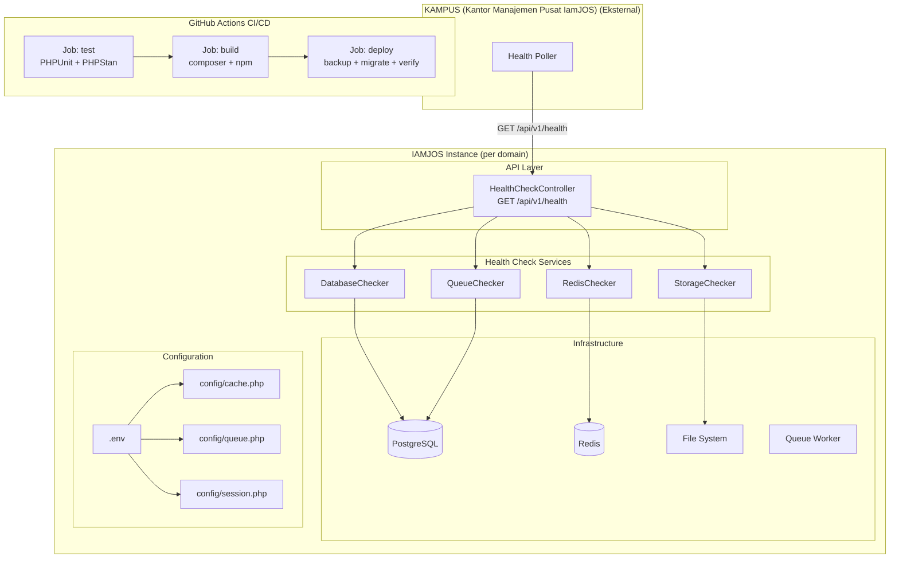
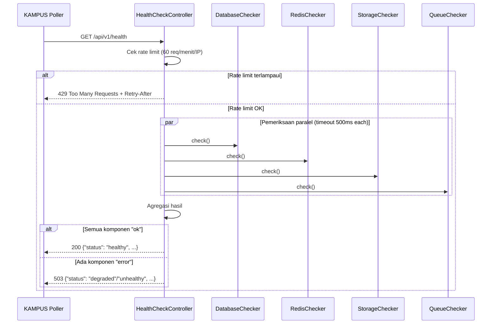
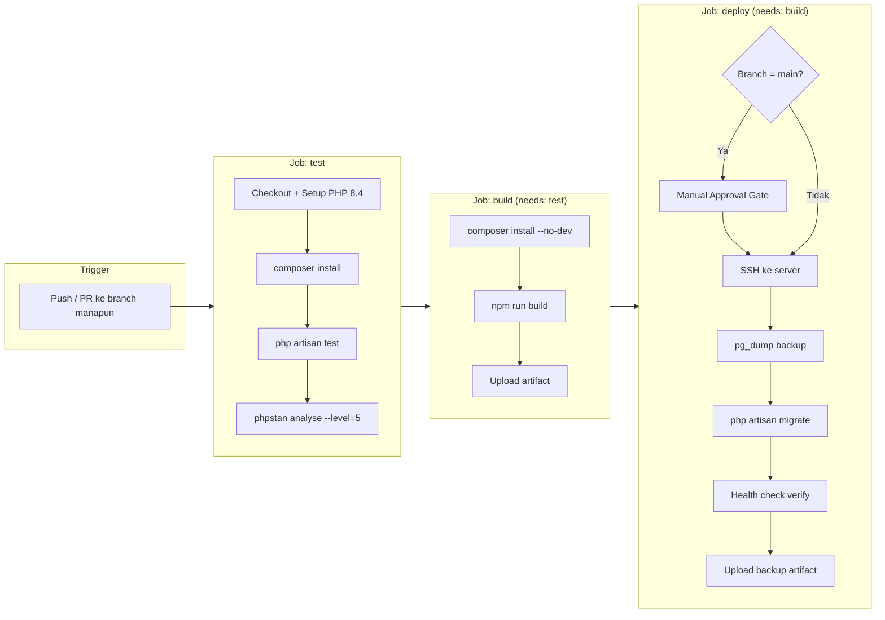

# Dokumen Desain: IAMJOS Phase 1 Infrastructure

## Ikhtisar

IAMJOS Phase 1 Infrastructure mencakup empat area fondasi yang memungkinkan platform jurnal akademik komersial ini beroperasi secara andal di lingkungan multi-instance production:

1. **Health Check API** — endpoint publik `GET /api/v1/health` yang memungkinkan KAMPUS (Kantor Manajemen Pusat IamJOS) memantau status setiap instance IAMJOS secara terpusat.
2. **CI/CD Pipeline** — pipeline GitHub Actions tiga-tahap (`test → build → deploy`) dengan approval gate untuk production dan backup database otomatis.
3. **Repository Cleanup** — penghapusan file sensitif (SQL dump, scratch files) dan pembaruan branding dari "open-source" menjadi "commercial proprietary".
4. **Redis Configuration** — konfigurasi Redis yang aman dan lengkap dengan isolasi per-instance menggunakan `IAMJOS_INSTANCE_ID` sebagai prefix.

Keempat komponen ini bersifat fondasi — tanpa health check, KAMPUS tidak bisa memantau; tanpa CI/CD yang benar, deployment berisiko; tanpa cleanup, data sensitif bisa bocor; tanpa Redis yang dikonfigurasi dengan benar, instance yang berbagi server Redis akan saling menimpa data.

---

## Arsitektur

### Gambaran Sistem



### Alur Health Check



### Alur CI/CD Pipeline



---

## Komponen dan Interface

### 1. Health Check API

#### `App\Http\Controllers\Api\HealthCheckController`

```php
class HealthCheckController extends Controller
{
    public function __invoke(Request $request): JsonResponse
```

Controller ini adalah single-action controller yang mengkoordinasikan semua pemeriksaan komponen dan mengembalikan response JSON terstandarisasi.

**Tanggung jawab:**
- Menjalankan semua checker secara paralel (menggunakan `concurrent()` atau `Promise`)
- Mengagregasi hasil dan menentukan status keseluruhan
- Mengembalikan response JSON dengan struktur yang konsisten
- Menangani exception tanpa mengekspos stack trace

#### `App\Services\HealthCheck\DatabaseChecker`

```php
interface HealthCheckerInterface
{
    public function check(): CheckResult;
}

class CheckResult
{
    public readonly string $status;   // "ok" | "error"
    public readonly ?string $message; // pesan error (tanpa kredensial)
    public readonly float $latencyMs;
}
```

**Implementasi DatabaseChecker:**
- Menjalankan `DB::select('SELECT 1')` dengan timeout 500ms
- Menangkap `QueryException` dan `PDOException`
- Tidak mengekspos connection string atau password dalam pesan error

#### `App\Services\HealthCheck\RedisChecker`

- Menjalankan `Redis::ping()` dengan timeout 500ms
- Menangkap `RedisException` dan `ConnectionException`

#### `App\Services\HealthCheck\StorageChecker`

- Mencoba menulis file temporary ke `storage/app/` dengan `Storage::put()`
- Menghapus file temporary setelah pengecekan
- Menangkap `IOException` dan permission errors

#### `App\Services\HealthCheck\QueueChecker`

- Membaca timestamp job terakhir yang diproses dari cache/database
- Membandingkan dengan `now()->subMinutes(5)`
- Mengembalikan "error" jika tidak ada job yang diproses dalam 5 menit terakhir

**Strategi pengecekan queue:**
Queue worker tidak meninggalkan "heartbeat" secara native di Laravel. Solusinya adalah menggunakan tabel `jobs` atau `cache` untuk menyimpan timestamp terakhir queue worker aktif. Implementasi yang direkomendasikan: cek apakah ada job yang berhasil diproses dalam 5 menit terakhir dengan melihat tabel `jobs` (jika kosong, worker aktif) atau menggunakan `cache` key `queue:last_processed_at` yang diupdate oleh job khusus.

#### Format Response JSON

```json
{
    "status": "healthy | degraded | unhealthy",
    "timestamp": "2025-01-15T10:30:00Z",
    "version": "1.0.0",
    "uptime_seconds": 86400,
    "instance_id": "iamjos-jurnal-xyz",
    "checks": {
        "database": {
            "status": "ok | error",
            "message": null,
            "latency_ms": 12.5
        },
        "redis": {
            "status": "ok | error",
            "message": null,
            "latency_ms": 1.2
        },
        "storage": {
            "status": "ok | error",
            "message": null,
            "latency_ms": 5.0
        },
        "queue": {
            "status": "ok | error",
            "message": null,
            "last_processed_at": "2025-01-15T10:25:00Z"
        }
    },
    "metrics": {
        "active_journals": 5,
        "pending_submissions": 12
    }
}
```

**Logika penentuan status keseluruhan:**
- `"healthy"` — semua komponen berstatus `"ok"`
- `"degraded"` — komponen non-kritis (storage, queue) ada yang `"error"`, tapi database dan Redis `"ok"`
- `"unhealthy"` — database atau Redis berstatus `"error"`, atau terjadi exception tidak tertangani

#### Route Definition

```php
// routes/api.php
Route::get('v1/health', \App\Http\Controllers\Api\HealthCheckController::class)
    ->middleware('throttle:60,1')
    ->name('api.health');
```

Middleware `throttle:60,1` membatasi 60 request per menit per IP. Tidak ada middleware autentikasi — endpoint ini harus dapat diakses publik oleh KAMPUS.

---

### 2. CI/CD Pipeline

#### File: `.github/workflows/deploy.yml`

Pipeline terdiri dari tiga job dengan dependency eksplisit:

**Job `test`** (trigger: semua push dan PR):
- Setup PHP 8.4 dengan ekstensi `pgsql`, `redis`, `gd`, `zip`
- Cache Composer dependencies
- Jalankan `php artisan test` (Pest)
- Jalankan `./vendor/bin/phpstan analyse --level=5`

**Job `build`** (needs: `test`):
- `composer install --no-dev --optimize-autoloader`
- `npm ci && npm run build`
- Upload artifact `build-assets`

**Job `deploy`** (needs: `build`):
- Hanya berjalan pada push ke branch `main`, `staging`, atau `dev`
- Untuk `main`: memerlukan GitHub Environment `production` dengan required reviewers
- Langkah deployment production:
  1. SSH ke server
  2. `pg_dump` → simpan sebagai artifact (retensi 7 hari)
  3. `git pull`
  4. Deploy artifact build
  5. `php artisan migrate --force`
  6. `curl -f GET /api/v1/health` — gagal jika bukan 200
  7. `php artisan config:cache && route:cache && view:cache`

#### Backup Strategy

```bash
# Dalam job deploy, sebelum migrate
BACKUP_FILE="backup-$(date +%Y%m%d-%H%M%S).sql.gz"
PGPASSWORD=$DB_PASSWORD pg_dump \
  -h $DB_HOST -U $DB_USERNAME $DB_DATABASE \
  | gzip > $BACKUP_FILE

# Upload sebagai GitHub Actions artifact
# retention-days: 7
```

Jika `pg_dump` gagal (exit code non-zero), pipeline berhenti dengan `set -e` atau explicit check.

---

### 3. Repository Cleanup

#### File yang Dihapus

| File/Direktori | Alasan |
|---|---|
| `db_iamjoss_20260429_013003_pgsql_data.sql.gz` | SQL dump sensitif |
| `iamjoss.sql.gz` | SQL dump sensitif |
| `iamjoss.id.tar.gz` | Archive sensitif |
| `db_iamjoss_20260429_013003_pgsql_data.sql/` | Direktori SQL dump |
| `iamjoss.sql/` | Direktori SQL dump |
| `scratch/` | File scratch development |
| `test_*.php` (root) | Script test ad-hoc |
| `scratch_db_check.php` | Script scratch |

#### Pembaruan `.gitignore`

Entri yang ditambahkan/diverifikasi:

```gitignore
# SQL dumps dan archive
*.sql
*.sql.gz
*.tar.gz

# Direktori scratch
/scratch/

# Script test ad-hoc di root
test_*.php
scratch_*.php

# Environment files
.env
.env.*
!.env.example
```

#### Pembaruan `SETUP.md`

Perubahan yang diperlukan:
- Hapus kalimat "IamJOS is an open-source academic journal management system"
- Ganti dengan: "IamJOS is a commercial proprietary academic journal management platform"
- Hapus referensi ke "inspired by OJS" jika menyiratkan open-source
- Perbarui bagian License untuk mencerminkan lisensi komersial
- Tambahkan bagian Redis Setup

---

### 4. Redis Configuration

#### Arsitektur Redis Multi-Database

Setiap instance IAMJOS menggunakan tiga database Redis yang terpisah untuk menghindari konflik:

| Database | Env Var | Default | Kegunaan |
|---|---|---|---|
| `REDIS_DB` | `REDIS_DB` | `0` | Queue dan koneksi default |
| `REDIS_CACHE_DB` | `REDIS_CACHE_DB` | `1` | Cache aplikasi |
| Session | `SESSION_STORE` → `redis` | DB `2` | Session pengguna |

Ketika beberapa instance IAMJOS berbagi satu Redis server, isolasi dicapai melalui **prefix berbasis INSTANCE_ID**:

```
Cache key: {IAMJOS_INSTANCE_ID}-cache-{key}
Queue name: {IAMJOS_INSTANCE_ID}-default
```

#### Perubahan `config/cache.php`

```php
'prefix' => env('CACHE_PREFIX', 
    (env('IAMJOS_INSTANCE_ID', 'iamjos') . '-cache-')
),
```

#### Perubahan `config/queue.php`

```php
'redis' => [
    'driver' => 'redis',
    'connection' => env('REDIS_QUEUE_CONNECTION', 'default'),
    'queue' => env('REDIS_QUEUE', 
        env('IAMJOS_INSTANCE_ID', 'iamjos') . '-default'
    ),
    'retry_after' => (int) env('REDIS_QUEUE_RETRY_AFTER', 90),
    'block_for' => null,
    'after_commit' => false,
],
```

#### Perubahan `config/session.php`

Tambahkan koneksi Redis terpisah untuk session (database 2):

```php
'connection' => env('SESSION_CONNECTION', 'session'),
```

Dan di `config/database.php`, tambahkan koneksi Redis `session`:

```php
'session' => [
    'url' => env('REDIS_URL'),
    'host' => env('REDIS_HOST', '127.0.0.1'),
    'username' => env('REDIS_USERNAME'),
    'password' => env('REDIS_PASSWORD'),
    'port' => env('REDIS_PORT', '6379'),
    'database' => env('REDIS_SESSION_DB', '2'),
],
```

#### Warning Redis Tanpa Password

Di `app/Providers/AppServiceProvider.php` atau middleware boot:

```php
if (app()->environment('production') 
    && empty(config('database.redis.default.password'))) {
    Log::warning('SECURITY WARNING: Redis is running without authentication in production environment.');
}
```

---

## Model Data

### CheckResult (Value Object)

```php
final class CheckResult
{
    public function __construct(
        public readonly string $status,      // "ok" | "error"
        public readonly ?string $message,    // null jika ok, pesan error jika error
        public readonly float $latencyMs,    // waktu eksekusi dalam milidetik
        public readonly array $metadata = [] // data tambahan (misal: last_processed_at untuk queue)
    ) {}

    public static function ok(float $latencyMs, array $metadata = []): self
    {
        return new self('ok', null, $latencyMs, $metadata);
    }

    public static function error(string $message, float $latencyMs): self
    {
        return new self('error', $message, $latencyMs);
    }
}
```

### HealthStatus (Enum)

```php
enum HealthStatus: string
{
    case Healthy   = 'healthy';   // semua komponen ok
    case Degraded  = 'degraded';  // komponen non-kritis error
    case Unhealthy = 'unhealthy'; // komponen kritis error
}
```

### HealthReport (DTO)

```php
final class HealthReport
{
    public function __construct(
        public readonly HealthStatus $status,
        public readonly string $timestamp,       // ISO 8601 UTC
        public readonly string $version,
        public readonly int $uptimeSeconds,
        public readonly string $instanceId,
        public readonly array $checks,           // [component => CheckResult]
        public readonly array $metrics,          // [metric_name => value]
    ) {}

    public function toArray(): array { ... }
    public function httpStatus(): int { ... } // 200 atau 503
}
```

### Struktur `.env.example` (Redis Section)

```dotenv
# ============================================================
# IAMJOS INSTANCE CONFIGURATION
# Setiap instance IAMJOS harus memiliki INSTANCE_ID yang unik.
# Nilai ini digunakan sebagai prefix untuk Redis keys dan queue
# names untuk menghindari konflik antar instance.
# ============================================================
IAMJOS_INSTANCE_ID=iamjos-instance-1
IAMJOS_LICENSE_KEY=           # Hubungi support@iamjos.id untuk mendapatkan kunci lisensi

# ============================================================
# REDIS CONFIGURATION
# Production: gunakan Redis untuk cache, queue, dan session.
# Pastikan Redis dikonfigurasi dengan password untuk keamanan.
# ============================================================
REDIS_CLIENT=phpredis
REDIS_HOST=127.0.0.1
REDIS_PASSWORD=               # WAJIB diisi di production!
REDIS_PORT=6379
REDIS_DB=0                    # Database untuk queue dan koneksi default
REDIS_CACHE_DB=1              # Database untuk cache (harus berbeda dari REDIS_DB)
REDIS_SESSION_DB=2            # Database untuk session (harus berbeda dari keduanya)

CACHE_STORE=redis
QUEUE_CONNECTION=redis
SESSION_DRIVER=redis
```

---

## Correctness Properties

*A property is a characteristic or behavior that should hold true across all valid executions of a system — essentially, a formal statement about what the system should do. Properties serve as the bridge between human-readable specifications and machine-verifiable correctness guarantees.*

### Property 1: HTTP Status Mencerminkan Status Kesehatan

*Untuk setiap* kombinasi hasil pemeriksaan komponen, HTTP status code yang dikembalikan harus konsisten: 200 jika semua komponen berstatus "ok", dan 503 jika satu atau lebih komponen berstatus "error".

**Validates: Requirements 1.2, 1.3**

---

### Property 2: Struktur Response Selalu Lengkap

*Untuk setiap* request ke `GET /api/v1/health` (apapun kondisi sistem), response harus selalu mengandung semua field wajib: `status`, `timestamp`, `version`, `uptime_seconds`, `instance_id`, `checks.database.status`, `checks.redis.status`, `checks.storage.status`, `checks.queue.status`, `metrics.active_journals`, `metrics.pending_submissions`, dan header `Content-Type: application/json`.

**Validates: Requirements 1.4, 1.10**

---

### Property 3: Status Komponen Mencerminkan Kegagalan

*Untuk setiap* komponen (database, Redis, storage, queue) yang gagal saat pemeriksaan, field `checks.{component}.status` dalam response harus bernilai `"error"`. Sebaliknya, jika komponen berhasil, statusnya harus `"ok"`. Pesan error tidak boleh mengandung kredensial (password, connection string).

**Validates: Requirements 1.5, 1.6, 1.7, 1.8**

---

### Property 4: Rate Limiting Konsisten

*Untuk setiap* IP address yang mengirim lebih dari 60 request dalam satu menit ke endpoint health check, request ke-61 dan seterusnya harus mendapatkan HTTP status 429 dengan header `Retry-After` yang valid.

**Validates: Requirements 1.9**

---

### Property 5: Response Time di Bawah Batas

*Untuk setiap* request ke `GET /api/v1/health`, total waktu response harus kurang dari 2000ms, bahkan ketika semua komponen diperiksa secara bersamaan.

**Validates: Requirements 1.11**

---

### Property 6: Exception Tidak Mengekspos Stack Trace

*Untuk setiap* exception yang tidak tertangani yang terjadi selama pemeriksaan komponen, response harus mengembalikan HTTP 503 dengan `status: "unhealthy"` dan tidak boleh mengandung stack trace, nama class exception, atau informasi internal sistem lainnya.

**Validates: Requirements 1.12**

---

### Property 7: .gitignore Mencegah File Sensitif

*Untuk setiap* file dengan pola `*.sql`, `*.sql.gz`, `*.tar.gz`, `.env`, atau `.env.*` (kecuali `.env.example`), perintah `git check-ignore` harus mengembalikan bahwa file tersebut diabaikan oleh `.gitignore`.

**Validates: Requirements 3.2, 3.5, 3.8**

---

### Property 8: Cache Prefix Mengandung Instance ID

*Untuk setiap* nilai `IAMJOS_INSTANCE_ID` yang dikonfigurasi, prefix cache yang digunakan oleh `config/cache.php` harus mengandung nilai tersebut sebagai substring, sehingga dua instance dengan ID berbeda tidak akan pernah menggunakan prefix yang sama.

**Validates: Requirements 4.4**

---

### Property 9: Queue Name Mengandung Instance ID

*Untuk setiap* nilai `IAMJOS_INSTANCE_ID` yang dikonfigurasi, nama queue Redis yang digunakan oleh `config/queue.php` harus mengandung nilai tersebut sebagai prefix, sehingga dua instance dengan ID berbeda tidak akan pernah menggunakan nama queue yang sama.

**Validates: Requirements 4.5**

---

### Property 10: Isolasi Database Redis

*Untuk setiap* konfigurasi yang valid, nilai `REDIS_DB` (untuk queue/default), `REDIS_CACHE_DB` (untuk cache), dan `REDIS_SESSION_DB` (untuk session) harus berbeda satu sama lain, sehingga data dari ketiga penggunaan tidak saling menimpa.

**Validates: Requirements 4.6, 4.10**

---

### Property 11: Warning Redis Tanpa Password di Production

*Untuk setiap* kondisi di mana aplikasi berjalan di environment `production` dengan `REDIS_PASSWORD` kosong atau tidak di-set, aplikasi harus mencatat setidaknya satu entri log dengan level `warning` yang mengindikasikan Redis berjalan tanpa autentikasi.

**Validates: Requirements 4.9**

---

## Penanganan Error

### Health Check API

| Kondisi Error | Penanganan | Response |
|---|---|---|
| Database tidak dapat dijangkau | Tangkap exception, set status "error" | 503, tanpa kredensial |
| Redis timeout | Tangkap exception setelah 500ms | 503 |
| Storage tidak dapat ditulis | Tangkap IOException | 503 |
| Queue worker tidak aktif | Cek timestamp, set "error" | 503 |
| Exception tidak tertangani | Global exception handler | 503, tanpa stack trace |
| Rate limit terlampaui | Laravel throttle middleware | 429 + Retry-After |

**Prinsip keamanan error:**
- Pesan error dalam response hanya boleh berisi deskripsi umum (misal: "Database connection failed")
- Tidak boleh mengekspos: hostname, port, username, password, path file, nama tabel
- Stack trace hanya dicatat ke log, tidak dikembalikan ke client

### CI/CD Pipeline

| Kondisi Error | Penanganan |
|---|---|
| Job `test` gagal | Pipeline berhenti, tidak lanjut ke `build` |
| `pg_dump` gagal | Deployment berhenti, tidak jalankan `migrate` |
| `migrate` gagal | Deployment gagal, notifikasi dikirim |
| Health check post-deploy gagal | Job `deploy` ditandai gagal, notifikasi dikirim |

### Redis Configuration

| Kondisi Error | Penanganan |
|---|---|
| Redis tidak dapat dijangkau | Laravel fallback ke driver lain (jika dikonfigurasi) atau throw exception |
| Redis tanpa password di production | Log warning, aplikasi tetap berjalan |
| INSTANCE_ID tidak di-set | Gunakan nilai default "iamjos", log warning |

---

## Strategi Pengujian

### Pendekatan Dual Testing

Pengujian menggunakan dua pendekatan yang saling melengkapi:
- **Unit tests**: memverifikasi contoh spesifik, edge case, dan kondisi error
- **Property tests**: memverifikasi properti universal di berbagai input yang di-generate secara acak

### Unit Tests (Pest)

**Health Check API:**
```
tests/Feature/Api/HealthCheckTest.php
- test endpoint dapat diakses tanpa autentikasi
- test response 200 ketika semua komponen sehat (mock semua checker)
- test response 503 ketika database gagal
- test response 503 ketika Redis gagal
- test response 503 ketika storage gagal
- test response 503 ketika queue tidak aktif
- test rate limiting mengembalikan 429 setelah 60 request
- test response tidak mengandung stack trace saat exception
- test semua field wajib ada dalam response
```

**Redis Configuration:**
```
tests/Unit/Config/RedisConfigTest.php
- test cache prefix mengandung INSTANCE_ID
- test queue name mengandung INSTANCE_ID
- test REDIS_DB berbeda dari REDIS_CACHE_DB
- test warning dicatat saat production tanpa password
```

**Repository Cleanup:**
```
tests/Unit/Repository/GitignoreTest.php
- test file SQL dump tidak ada di repository
- test direktori scratch tidak ada
- test file test_*.php tidak ada di root
- test SETUP.md tidak mengandung kata "open-source"
```

### Property Tests (Pest + fast-check atau manual property testing)

Karena Pest tidak memiliki built-in property testing, gunakan pendekatan **data provider** dengan banyak input yang di-generate, atau integrasikan library seperti `eris/eris` untuk PHP.

**Konfigurasi minimum: 100 iterasi per property test.**

**Property Test 1: HTTP Status Mencerminkan Status Kesehatan**
```php
// Feature: iamjos-phase1-infrastructure, Property 1: HTTP status mencerminkan status kesehatan
it('returns 200 when all components are healthy and 503 when any fails', function () {
    // Generate kombinasi acak dari komponen yang sehat/gagal
    // Verifikasi HTTP status code konsisten dengan status keseluruhan
})->repeat(100);
```

**Property Test 2: Struktur Response Selalu Lengkap**
```php
// Feature: iamjos-phase1-infrastructure, Property 2: Struktur response selalu lengkap
it('always returns complete response structure regardless of component status', function () {
    // Generate kondisi sistem acak
    // Verifikasi semua field wajib ada
})->repeat(100);
```

**Property Test 3: Status Komponen Mencerminkan Kegagalan**
```php
// Feature: iamjos-phase1-infrastructure, Property 3: Status komponen mencerminkan kegagalan
it('component status accurately reflects failure without exposing credentials', function () {
    // Generate komponen yang gagal secara acak
    // Verifikasi status "error" dan tidak ada kredensial dalam response
})->repeat(100);
```

**Property Test 4: Rate Limiting Konsisten**
```php
// Feature: iamjos-phase1-infrastructure, Property 4: Rate limiting konsisten
it('returns 429 with Retry-After after exceeding 60 requests per minute', function () {
    // Kirim 61+ request dari IP yang sama
    // Verifikasi request ke-61 mendapat 429 + Retry-After
})->repeat(100);
```

**Property Test 7: .gitignore Mencegah File Sensitif**
```php
// Feature: iamjos-phase1-infrastructure, Property 7: .gitignore mencegah file sensitif
it('gitignore blocks all sensitive file patterns', function (string $filename) {
    // Generate nama file acak dengan pola sensitif
    // Verifikasi git check-ignore menolaknya
})->with(fn() => generateSensitiveFilenames(100));
```

**Property Test 8 & 9: Instance ID dalam Prefix/Queue**
```php
// Feature: iamjos-phase1-infrastructure, Property 8 & 9: Instance ID dalam prefix dan queue
it('cache prefix and queue name always contain instance ID', function (string $instanceId) {
    // Set IAMJOS_INSTANCE_ID ke nilai acak
    // Verifikasi prefix cache dan nama queue mengandung nilai tersebut
})->with(fn() => generateInstanceIds(100));
```

**Property Test 10: Isolasi Database Redis**
```php
// Feature: iamjos-phase1-infrastructure, Property 10: Isolasi database Redis
it('redis database numbers are always distinct for cache, queue, and session', function () {
    // Verifikasi REDIS_DB, REDIS_CACHE_DB, REDIS_SESSION_DB selalu berbeda
})->repeat(100);
```

### Testing CI/CD Pipeline

Pipeline CI/CD diuji secara fungsional melalui:
- Dry-run dengan `act` (GitHub Actions local runner) untuk validasi YAML
- Integration test: push ke branch `dev` dan verifikasi semua job berjalan
- Verifikasi manual approval gate aktif untuk branch `main`
