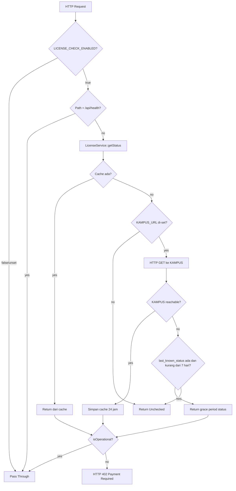

# Dokumen Desain: IAMJOS Phase 2 — Metrics & Licensing

## Ikhtisar

Fitur ini mencakup dua komponen independen:

**Komponen 1 — Article Metrics via Queued Job**: Memindahkan pencatatan view/download artikel dari operasi synchronous di request cycle ke background job Laravel Queue. Ini menghilangkan latency tambahan pada setiap request artikel publik.

**Komponen 2 — License Validation System (Scaffold)**: Menyiapkan infrastruktur validasi lisensi yang dapat diaktifkan saat KAMPUS (Kantor Manajemen Pusat IamJOS) tersedia. Seluruh sistem bersifat opt-in via environment variable — instance yang sudah berjalan tidak terpengaruh sama sekali.

---

## Arsitektur

### Komponen 1: Article Metrics Queue

```
Request Artikel/Download
        │
        ▼
PublicController (resolveGeoIp)
        │
        ▼ dispatch (non-blocking)
RecordArticleMetricJob
        │
        ▼ (background, via queue worker)
DB::table('article_metrics')->updateOrInsert()
        │
        ▼
Cache::put('queue:last_processed_at', now(), 600)
```

### Komponen 2: License Validation Flow



---

## Komponen dan Interface

### 1. RecordArticleMetricJob

**File:** `app/Jobs/RecordArticleMetricJob.php`

```php
class RecordArticleMetricJob implements ShouldQueue
{
    use Queueable;

    public function __construct(
        public readonly string  $submissionId,
        public readonly string  $type,        // 'view' | 'download'
        public readonly ?string $ipAddress,
        public readonly ?string $countryCode,
        public readonly ?string $city,
        public readonly string  $date,        // Y-m-d
    ) {}

    public function handle(): void;
}
```

**Idempotency key:** `(submission_id, type, ip_address, date)` — menggunakan `updateOrInsert` sehingga job yang dijalankan ulang tidak menghasilkan duplikasi data.

**Heartbeat:** Setelah berhasil, memperbarui `Cache::put('queue:last_processed_at', now()->toIso8601String(), 600)` — digunakan oleh `QueueChecker` di Health Check API.

**Error handling:** Semua `\Throwable` ditangkap, di-log, dan job diselesaikan tanpa re-throw agar queue worker tidak crash.

### 2. LicenseStatus Enum

**File:** `app/Enums/LicenseStatus.php`

```php
enum LicenseStatus: string
{
    case Valid        = 'valid';
    case Invalid      = 'invalid';
    case Expired      = 'expired';
    case Unregistered = 'unregistered';
    case Unchecked    = 'unchecked';

    public function label(): string;
    public function isOperational(): bool;  // true hanya untuk Valid dan Unchecked
    public static function fromString(string $value): self;  // fallback ke Unchecked
}
```

### 3. LicenseService

**File:** `app/Services/LicenseService.php`

**Cache keys:**
- `iamjos:license:status` — TTL 24 jam (status terkini)
- `iamjos:license:last_known_status` — TTL 7 hari (grace period fallback, hanya diisi jika Valid)

**Alur `getStatus()`:**
1. Jika `IAMJOS_LICENSE_CHECK_ENABLED` false/unset → return `Valid`
2. Cek cache `iamjos:license:status` → return jika ada
3. Jika `IAMJOS_KAMPUS_URL` kosong → return `Unchecked`
4. HTTP GET ke KAMPUS dengan header `Authorization: Bearer {IAMJOS_LICENSE_KEY}`, timeout 5 detik
5. Jika sukses → simpan ke cache 24 jam, update `last_known_status` jika Valid, return status
6. Jika gagal (timeout/5xx/connection refused) → cek `last_known_status`
7. Jika `last_known_status` ada dan < 7 hari → return grace period status
8. Fallback → return `Unchecked`

**Keputusan desain:** HTTP 4xx dari KAMPUS (401, 403) diperlakukan sebagai `Invalid`, bukan fallback ke cache — karena ini adalah respons eksplisit dari KAMPUS, bukan kegagalan jaringan.

### 4. CheckLicenseCommand

**File:** `app/Console/Commands/CheckLicenseCommand.php`

**Signature:** `iamjos:license:check {--refresh}`

**Output contoh:**
```
+---------------------+------------------+
| Parameter           | Nilai            |
+---------------------+------------------+
| Status Lisensi      | Lisensi aktif... |
| IAMJOS_LICENSE_KEY  | ABCD1234****     |
| IAMJOS_KAMPUS_URL   | https://kampus.. |
| LICENSE_CHECK_ENABLED | true           |
+---------------------+------------------+
[valid] Lisensi aktif dan valid
```

**Exit codes:** 0 untuk Valid/Unchecked, 1 untuk Expired/Invalid/Unregistered.

### 5. LicenseMiddleware

**File:** `app/Http/Middleware/LicenseMiddleware.php`

**Alias:** `iamjos.license`

**Bypass conditions:**
- `IAMJOS_LICENSE_CHECK_ENABLED=false` atau tidak di-set
- Path `/api/v1/health` atau `/api/health`

**Response 402 format:**
```json
{
  "message": "Akses ditolak: Lisensi telah kedaluwarsa",
  "status": "expired",
  "code": "LICENSE_EXPIRED"
}
```

### 6. FeatureFlag Helper

**File:** `app/Helpers/FeatureFlag.php`

**Konstanta fitur:**
- `ADVANCED_ANALYTICS`
- `MULTI_JOURNAL`
- `OAI_PMH`
- `CROSSREF_INTEGRATION`

**Fail-open behavior:** Jika `LICENSE_CHECK_ENABLED=false` atau status `Unchecked`, semua fitur aktif.

---

## Model Data

### Cache Keys Redis

| Key | TTL | Isi |
|-----|-----|-----|
| `iamjos:license:status` | 24 jam | String nilai LicenseStatus |
| `iamjos:license:last_known_status` | 7 hari | String nilai LicenseStatus (hanya Valid) |
| `iamjos:license:features` | 24 jam | JSON array nama fitur yang diizinkan |
| `queue:last_processed_at` | 10 menit | ISO 8601 timestamp terakhir job diproses |

### Variabel Environment Baru

```dotenv
# KAMPUS = Kantor Manajemen Pusat IamJOS
# Aktifkan hanya jika KAMPUS sudah tersedia.
# Default: false — semua instance berjalan tanpa validasi lisensi.
IAMJOS_LICENSE_CHECK_ENABLED=false
IAMJOS_KAMPUS_URL=              # URL disediakan oleh tim IamJOS saat KAMPUS aktif
```

Variabel `IAMJOS_LICENSE_KEY` yang sudah ada di `.env.example` diperbarui komentarnya untuk menjelaskan penggunaannya sebagai Bearer token saat validasi ke KAMPUS.

---

## Correctness Properties

### Property 1: Job idempotent

*Untuk semua* kombinasi `(submission_id, type, ip_address, date)` yang sama, menjalankan `RecordArticleMetricJob` dua kali tidak boleh menghasilkan dua baris berbeda di tabel `article_metrics`.

**Validates: Requirements 1.6**

---

### Property 2: Job tidak crash queue worker

*Untuk semua* kondisi di mana `RecordArticleMetricJob::handle()` melempar exception, job harus diselesaikan tanpa re-throw sehingga queue worker tetap berjalan.

**Validates: Requirements 1.7**

---

### Property 3: Heartbeat diperbarui setelah job berhasil

*Untuk semua* eksekusi `RecordArticleMetricJob` yang berhasil (tidak throw exception), cache key `queue:last_processed_at` harus diperbarui dengan timestamp ISO 8601 saat ini.

**Validates: Requirements 1.3, 1.9**

---

### Property 4: PublicController tidak lagi melakukan insert synchronous

*Untuk semua* request artikel dan download yang bukan bot, `PublicController` tidak boleh memanggil `DB::table('article_metrics')->insert()` secara langsung — harus menggunakan `RecordArticleMetricJob::dispatch()`.

**Validates: Requirements 1.4, 1.5**

---

### Property 5: LicenseStatus isOperational konsisten

*Untuk semua* case `LicenseStatus`, `isOperational()` harus mengembalikan `true` hanya untuk `Valid` dan `Unchecked`, dan `false` untuk semua case lainnya.

**Validates: Requirements 2.3**

---

### Property 6: LicenseStatus fromString fallback ke Unchecked

*Untuk semua* string yang tidak cocok dengan nilai enum yang valid, `LicenseStatus::fromString()` harus mengembalikan `LicenseStatus::Unchecked`.

**Validates: Requirements 2.4**

---

### Property 7: LicenseService bypass ketika check disabled

*Untuk semua* kondisi di mana `IAMJOS_LICENSE_CHECK_ENABLED` adalah `false` atau tidak di-set, `LicenseService::getStatus()` harus mengembalikan `LicenseStatus::Valid` tanpa melakukan HTTP request apapun ke KAMPUS.

**Validates: Requirements 3.11, 7.4**

---

### Property 8: LicenseService menggunakan cache — tidak hit KAMPUS dua kali

*Untuk semua* kondisi di mana cache `iamjos:license:status` sudah terisi, memanggil `LicenseService::getStatus()` tidak boleh menghasilkan HTTP request ke KAMPUS.

**Validates: Requirements 3.2**

---

### Property 9: Grace period — fallback ke last_known_status saat KAMPUS tidak terjangkau

*Untuk semua* kondisi di mana KAMPUS tidak dapat dijangkau dan cache `iamjos:license:last_known_status` tersedia dengan usia kurang dari 7 hari, `LicenseService::getStatus()` harus mengembalikan status dari fallback cache tersebut (bukan `Unchecked`).

**Validates: Requirements 3.5, 3.6**

---

### Property 10: LicenseMiddleware bypass untuk health check

*Untuk semua* request ke path `/api/v1/health` atau `/api/health`, `LicenseMiddleware` harus meneruskan request tanpa pengecekan lisensi, bahkan ketika `IAMJOS_LICENSE_CHECK_ENABLED=true` dan status lisensi `Expired`.

**Validates: Requirements 5.5**

---

### Property 11: FeatureFlag fail-open untuk Unchecked

*Untuk semua* nama fitur yang valid, `FeatureFlag::isEnabled()` harus mengembalikan `true` ketika status lisensi adalah `Unchecked`.

**Validates: Requirements 6.5**

---

### Property 12: FeatureFlag fail-open ketika check disabled

*Untuk semua* nama fitur, `FeatureFlag::isEnabled()` harus mengembalikan `true` ketika `IAMJOS_LICENSE_CHECK_ENABLED=false`.

**Validates: Requirements 6.2**

---

## Penanganan Error

### RecordArticleMetricJob

- Semua `\Throwable` ditangkap di dalam `handle()`
- Error di-log dengan `Log::error()` beserta konteks `submission_id`, `type`, `date`
- Job diselesaikan tanpa re-throw (tidak masuk ke failed jobs queue)

### LicenseService

- HTTP timeout: 5 detik — mencegah blocking jika KAMPUS lambat
- `ConnectionException` dan `RequestException` → fallback ke grace period cache
- HTTP 5xx dari KAMPUS → perlakukan sama seperti unreachable (fallback ke cache)
- HTTP 4xx dari KAMPUS (401, 403) → perlakukan sebagai `Invalid` (respons eksplisit, bukan kegagalan jaringan)
- `IAMJOS_KAMPUS_URL` kosong → return `Unchecked` langsung tanpa mencoba request

### LicenseMiddleware

- Exception dari `LicenseService::getStatus()` → fail-open, teruskan request (jangan blokir karena error internal)

---

## Strategi Pengujian

### Unit Tests

- `RecordArticleMetricJob`: insert data, heartbeat cache, idempotency, exception handling
- `LicenseStatus`: label, isOperational, fromString
- `LicenseService`: bypass disabled, cache hit, HTTP request ke KAMPUS, grace period, clearCache
- `CheckLicenseCommand`: output, --refresh, exit codes
- `LicenseMiddleware`: bypass disabled, bypass health, pass Valid/Unchecked, block 402
- `LicenseService` alur HTTP request ke KAMPUS (mock Http facade)
- `FeatureFlag::isEnabled()` dengan berbagai kombinasi status dan nama fitur
