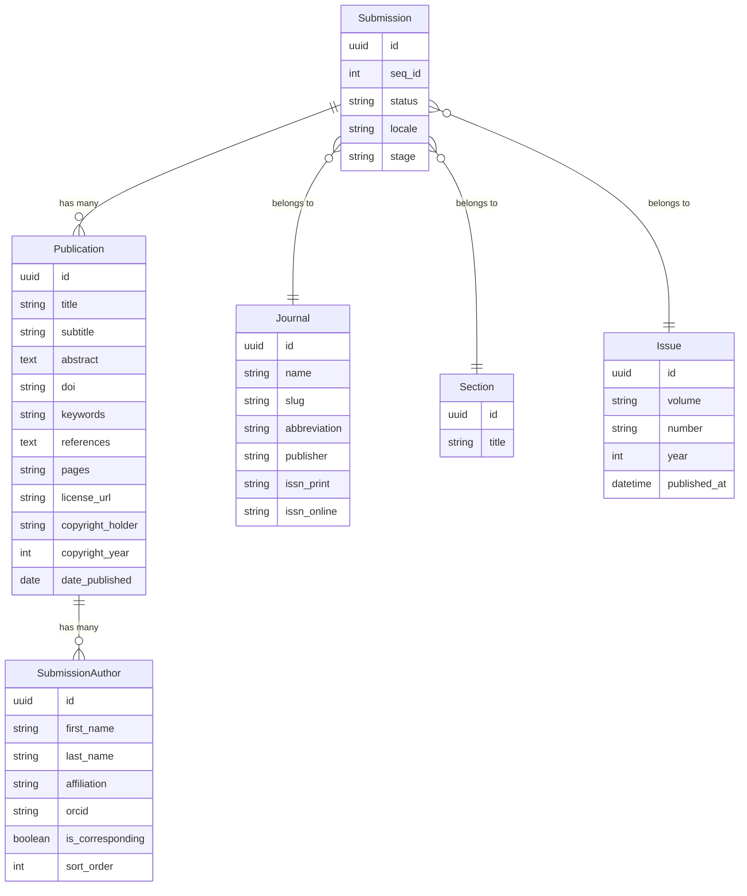

# Dokumen Desain: JATS XML Export (iamjos-phase3a-jats-xml)

## Overview

Fitur ini menambahkan kemampuan ekspor JATS 1.3 XML ke platform IAMJOS. JATS (Journal Article Tag Suite) adalah standar XML ISO 9573-13 yang digunakan oleh PubMed Central, Crossref, Scopus, dan Web of Science untuk indexing dan harvesting metadata artikel jurnal akademik.

Implementasi terdiri dari tiga lapisan:

1. **`JatsXmlService`** — service class yang menghasilkan JATS 1.3 XML valid dari data `Submission` menggunakan PHP `DOMDocument`
2. **`JatsXmlController`** — controller yang menangani dua route: publik (artikel published) dan admin (workflow preview)
3. **View update** — tombol "JATS XML" di sidebar halaman artikel publik

Desain mengikuti pola yang sudah ada di codebase: `CrossrefExportController` untuk pola controller XML, `crossref_xml.blade.php` untuk pola pemrosesan data (BCP47 locale, DOI extraction, abstract stripping), dan `article.blade.php` untuk pola keyword parsing dan reference splitting.

---

## Architecture

```mermaid
graph TD
    A[Browser / Harvester] -->|GET /{journal}/article/{article}/jats| B[JatsXmlController::article]
    C[Editor / Manager] -->|GET /{journal}/workflow/{submission}/jats| D[JatsXmlController::workflowPreview]
    B --> E[JatsXmlService::generate]
    D --> E
    E --> F[DOMDocument Builder]
    F --> G[buildFront]
    F --> H[buildBack]
    G --> I[buildJournalMeta]
    G --> J[buildArticleMeta]
    J --> K[buildContribGroup]
    H --> L[buildRefList]
    F -->|string XML| B
    F -->|string XML| D
    B -->|Response application/xml| A
    D -->|Response application/xml| C

    subgraph Models
        M[Submission]
        N[Publication]
        O[SubmissionAuthor]
        P[Issue]
        Q[Journal]
        R[Section]
    end

    E --> M
    M --> N
    M --> O
    M --> P
    M --> Q
    M --> R
```

Alur data:
- Controller menerima request, me-resolve `Journal` dan `Submission`
- Controller memanggil `JatsXmlService::generate(Submission $submission)`
- Service membangun XML menggunakan `DOMDocument` secara programatik
- Controller mengembalikan response `application/xml` dengan header `Content-Disposition`

---

## Components and Interfaces

### JatsXmlService

**Path:** `app/Services/JatsXmlService.php`

Service ini adalah inti dari fitur. Menggunakan PHP `DOMDocument` untuk membangun XML secara programatik — bukan string concatenation — sehingga well-formedness dan XML escaping dijamin oleh library.

```php
namespace App\Services;

use App\Models\Submission;
use DOMDocument;
use DOMElement;
use InvalidArgumentException;

class JatsXmlService
{
    private DOMDocument $dom;
    private DOMElement $root;

    /**
     * Entry point utama. Mengembalikan string JATS 1.3 XML.
     *
     * @throws InvalidArgumentException jika submission tidak memiliki publication atau journal
     */
    public function generate(Submission $submission): string;

    /**
     * Membangun elemen <front> berisi journal-meta dan article-meta.
     */
    private function buildFront(Submission $submission): DOMElement;

    /**
     * Membangun elemen <journal-meta>.
     */
    private function buildJournalMeta(Submission $submission): DOMElement;

    /**
     * Membangun elemen <article-meta> dengan semua sub-elemen.
     */
    private function buildArticleMeta(Submission $submission): DOMElement;

    /**
     * Membangun elemen <contrib-group> berisi semua author.
     */
    private function buildContribGroup(Submission $submission): DOMElement;

    /**
     * Membangun elemen <back> berisi <ref-list>.
     */
    private function buildBack(Submission $submission): ?DOMElement;

    /**
     * Membangun elemen <ref-list> dari references string.
     */
    private function buildRefList(string $references): DOMElement;

    /**
     * Konversi locale OJS ke format BCP47.
     * Contoh: "id_ID" → "id", "en_US" → "en"
     */
    private function toBcp47(string $locale): string;

    /**
     * Petakan section title ke nilai article-type JATS.
     * Contoh: "Research Article" → "research-article"
     * Default: "research-article"
     */
    private function sectionToArticleType(?string $sectionTitle): string;

    /**
     * Ekstrak DOI dari teks referensi menggunakan regex.
     * Pola: /\b(10\.\d{4,}\/\S+)/i
     */
    private function extractDoi(string $refText): ?string;

    /**
     * Bersihkan ORCID dari prefix URL yang mungkin sudah ada.
     * Contoh: "https://orcid.org/0000-0001-2345-6789" → "0000-0001-2345-6789"
     */
    private function cleanOrcid(string $orcid): string;

    /**
     * Parse keywords dari berbagai format (string CSV, JSON array, iterable).
     * Mengikuti pola yang sudah ada di article.blade.php.
     *
     * @return string[]
     */
    private function parseKeywords(mixed $keywords): array;
}
```

**Mapping section title → article-type:**

| Section Title (case-insensitive) | article-type |
|---|---|
| research article, original article, original research | `research-article` |
| review, review article, literature review | `review-article` |
| case report, case study | `case-report` |
| editorial | `editorial` |
| letter, letter to the editor | `letter` |
| brief report, brief communication | `brief-report` |
| *(default)* | `research-article` |

---

### JatsXmlController

**Path:** `app/Http/Controllers/Public/JatsXmlController.php`

```php
namespace App\Http\Controllers\Public;

use App\Http\Controllers\Controller;
use App\Models\Journal;
use App\Models\Submission;
use App\Services\JatsXmlService;
use Illuminate\Http\Response;

class JatsXmlController extends Controller
{
    public function __construct(private JatsXmlService $jatsService) {}

    /**
     * Route publik: GET /{journal}/article/{article}/jats
     * Hanya untuk submission yang sudah published.
     * Mengembalikan 404 jika tidak ditemukan atau belum published.
     */
    public function article(string $journalSlug, mixed $article): Response;

    /**
     * Route admin: GET /{journal}/workflow/{submission}/jats
     * Untuk preview dari halaman workflow, termasuk submission yang belum published.
     * Memerlukan autentikasi dan role editor/manager.
     */
    public function workflowPreview(string $journalSlug, Submission $submission): Response;

    /**
     * Helper: membangun response XML dengan header yang benar.
     */
    private function xmlResponse(string $xml, string $filename): Response;
}
```

**Nama file response:** `{journal-slug}-{seq_id}.xml`

---

### Routes

Dua route baru ditambahkan ke `routes/web.php` di dalam blok `Route::prefix('{journal}')`:

```php
// Route publik JATS XML — tanpa autentikasi
Route::get('/article/{article}/jats', [JatsXmlController::class, 'article'])
    ->name('journal.article.jats');

// Route admin JATS XML — autentikasi + role editor/manager
Route::middleware(['auth', 'journal.context', 'role:Editor|Section Editor|Journal Manager|Admin|Super Admin'])
    ->get('/workflow/{submission}/jats', [JatsXmlController::class, 'workflowPreview'])
    ->name('journal.workflow.jats');
```

Route publik ditempatkan di blok public routes (section 7), konsisten dengan route `citation.ris` dan `citation.bibtex` yang sudah ada. Route admin ditempatkan di blok workflow (section 8).

---

### View Update: article.blade.php

Tombol "JATS XML" ditambahkan di sidebar download section, setelah link galley PDF yang sudah ada. Mengikuti desain OJS flat yang sudah ada.

```blade
{{-- JATS XML Download --}}
<a href="{{ route('journal.article.jats', ['journal' => $journal->slug, 'article' => $article->seq_id]) }}"
   class="flex items-center gap-2 text-sm text-slate-700 hover:text-primary-600 hover:underline">
    <i class="fa-solid fa-file-code text-slate-400"></i>
    JATS XML
</a>
```

---

## Data Models

Fitur ini tidak membuat tabel baru. Semua data diambil dari model yang sudah ada:



**Field mapping ke JATS XML:**

| Field Model | Elemen JATS |
|---|---|
| `journal->slug` | `<journal-id journal-id-type="publisher-id">` |
| `journal->name` | `<journal-title>` |
| `journal->abbreviation` | `<abbrev-journal-title>` |
| `journal->issn_print` | `<issn pub-type="ppub">` |
| `journal->issn_online` | `<issn pub-type="epub">` |
| `journal->publisher` | `<publisher-name>` |
| `publication->doi` | `<article-id pub-id-type="doi">` |
| `publication->title` | `<article-title>` |
| `publication->subtitle` | `<subtitle>` |
| `publication->abstract` | `<abstract><p>` (setelah strip_tags) |
| `publication->keywords` | `<kwd-group><kwd>` |
| `publication->references` | `<ref-list><ref>` |
| `publication->pages` | `<fpage>` dan `<lpage>` |
| `publication->license_url` | `<ali:license_ref>` |
| `publication->copyright_holder` | `<copyright-holder>` |
| `publication->copyright_year` | `<copyright-year>` |
| `publication->date_published` | `<pub-date>` (prioritas) |
| `issue->published_at` | `<pub-date>` (fallback) |
| `issue->volume` | `<volume>` |
| `issue->number` | `<issue>` |
| `author->last_name` | `<surname>` |
| `author->first_name` | `<given-names>` |
| `author->affiliation` | `<aff>` |
| `author->orcid` | `<contrib-id contrib-id-type="orcid">` |
| `author->is_corresponding` | atribut `corresp="yes"` |
| `submission->locale` | atribut `xml:lang` (setelah konversi BCP47) |
| `section->title` | atribut `article-type` (setelah mapping) |

---

## Correctness Properties

*A property is a characteristic or behavior that should hold true across all valid executions of a system — essentially, a formal statement about what the system should do. Properties serve as the bridge between human-readable specifications and machine-verifiable correctness guarantees.*

### Property 1: Round-trip XML parse

*For any* submission yang valid (memiliki publication dan journal), output dari `JatsXmlService::generate()` harus dapat di-parse ulang oleh `DOMDocument::loadXML()` tanpa error — artinya XML yang dihasilkan selalu well-formed.

**Validates: Requirements 7.1, 7.5, 1.11**

---

### Property 2: Namespace declarations selalu hadir

*For any* submission, elemen root `<article>` pada output XML harus selalu mengandung atribut `xmlns:xlink="http://www.w3.org/1999/xlink"`, `xmlns:ali="http://www.niso.org/schemas/ali/1.0/"`, dan `dtd-version="1.3"`.

**Validates: Requirements 7.2, 7.3**

---

### Property 3: BCP47 locale conversion

*For any* locale string dalam format OJS (misal `id_ID`, `en_US`, `pt_BR`), hasil konversi `toBcp47()` harus berupa string tanpa underscore dan kode negara — hanya kode bahasa dua huruf.

**Validates: Requirements 1.2**

---

### Property 4: Elemen opsional tidak muncul saat data kosong

*For any* submission di mana field opsional (DOI, ORCID, subtitle, pages, license_url) bernilai null atau kosong, elemen JATS yang bersesuaian tidak boleh muncul dalam output XML (tidak ada elemen kosong).

**Validates: Requirements 7.4**

---

### Property 5: Author ordering dipertahankan

*For any* submission dengan beberapa author, urutan `<contrib>` dalam `<contrib-group>` harus sama dengan urutan `sort_order` dari `publication->authors`.

**Validates: Requirements 2.3**

---

### Property 6: Reference round-trip

*For any* string references yang tidak kosong, jumlah elemen `<ref>` dalam output XML harus sama dengan jumlah baris non-kosong (panjang > 5 karakter) setelah split by newline.

**Validates: Requirements 5.2, 5.3, 5.4**

---

### Property 7: Whitespace-only keywords ditolak

*For any* keyword yang terdiri dari whitespace saja (setelah trim), keyword tersebut tidak boleh menghasilkan elemen `<kwd>` dalam output XML.

**Validates: Requirements 2.14**

---

### Property 8: XML escaping karakter spesial

*For any* string yang mengandung karakter XML spesial (`<`, `>`, `&`, `"`, `'`), nilai yang dimasukkan ke dalam elemen atau atribut XML harus di-escape dengan benar sehingga XML tetap well-formed.

**Validates: Requirements 1.9**

---

### Property 9: Route publik mengembalikan 404 untuk submission tidak published

*For any* request ke route publik dengan `seq_id` yang merujuk ke submission yang belum published (atau tidak ada), response harus HTTP 404.

**Validates: Requirements 3.4, 3.5, 3.6**

---

### Property 10: Route admin dapat mengakses submission belum published

*For any* submission dalam jurnal yang sama (terlepas dari status published), route admin yang diakses oleh editor/manager harus mengembalikan XML yang valid (bukan 404).

**Validates: Requirements 4.7**

---

## Error Handling

### JatsXmlService

| Kondisi | Penanganan |
|---|---|
| `submission->currentPublication` null | Lempar `InvalidArgumentException("Submission {$submission->id} has no publication")` |
| `submission->journal` null | Lempar `InvalidArgumentException("Submission {$submission->id} has no journal")` |
| `publication->authors` kosong/null | Hasilkan `<contrib-group>` kosong, tidak error |
| `submission->locale` null/invalid | Gunakan default `"en"` untuk `xml:lang` |
| `publication->keywords` format tidak dikenal | Hasilkan `<kwd-group>` kosong, tidak error |
| `publication->pages` tanpa tanda `-` | Hasilkan `<fpage>` saja tanpa `<lpage>` |
| `publication->references` null/kosong | Hasilkan `<back/>` kosong atau hilangkan `<back>` |

### JatsXmlController

| Kondisi | HTTP Response |
|---|---|
| Journal tidak ditemukan | 404 |
| Submission tidak ditemukan dalam jurnal | 404 |
| Submission tidak published (route publik) | 404 |
| Submission tidak memiliki currentPublication (route publik) | 404 |
| User tidak memiliki role editor/manager (route admin) | 403 |
| `JatsXmlService` melempar `InvalidArgumentException` | 500 (atau 422 dengan pesan error) |

---

## Testing Strategy

### Unit Tests

Unit test memverifikasi contoh spesifik, edge case, dan kondisi error:

- `JatsXmlServiceTest`:
  - Test bahwa XML yang dihasilkan dapat di-parse oleh `DOMDocument::loadXML()`
  - Test bahwa namespace declarations hadir di elemen root
  - Test konversi BCP47: `id_ID` → `id`, `en_US` → `en`, `pt_BR` → `pt`
  - Test mapping section title: "Research Article" → `research-article`, "Review" → `review-article`, unknown → `research-article`
  - Test elemen opsional tidak muncul saat null (DOI, ORCID, subtitle, pages)
  - Test `corresp="yes"` hanya pada corresponding author
  - Test `strip_tags` pada abstract
  - Test DOI extraction dari referensi
  - Test ORCID cleaning dari URL prefix
  - Test keyword parsing: string CSV, JSON array, iterable
  - Test `InvalidArgumentException` saat publication null
  - Test `InvalidArgumentException` saat journal null

- `JatsXmlControllerTest`:
  - Test route publik mengembalikan 200 + `application/xml` untuk artikel published
  - Test route publik mengembalikan 404 untuk artikel tidak published
  - Test route publik mengembalikan 404 untuk `seq_id` tidak ada
  - Test header `Content-Disposition` berisi nama file yang benar
  - Test route admin mengembalikan 200 untuk editor/manager
  - Test route admin mengembalikan 403 untuk user tanpa role
  - Test route admin dapat mengakses submission belum published

### Property-Based Tests

Property test memverifikasi properti universal menggunakan library **[Eris](https://github.com/giorgiosironi/eris)** (PHP property-based testing library) atau **[PHPUnit dengan data provider generatif](https://phpunit.de/)**.

Setiap property test dikonfigurasi minimum **100 iterasi**.

Format tag: `Feature: iamjos-phase3a-jats-xml, Property {N}: {property_text}`

**Property 1 — Round-trip XML parse:**
```php
// Feature: iamjos-phase3a-jats-xml, Property 1: Round-trip XML parse
// For any valid submission, generate() output must be parseable by DOMDocument::loadXML()
public function test_generated_xml_is_always_well_formed(): void
{
    // Generate random submissions with varying data completeness
    // Assert: DOMDocument::loadXML($xml) returns true without errors
}
```

**Property 3 — BCP47 locale conversion:**
```php
// Feature: iamjos-phase3a-jats-xml, Property 3: BCP47 locale conversion
// For any OJS locale string, toBcp47() result must not contain underscore
public function test_bcp47_conversion_removes_country_code(): void
{
    // Generate random locale strings in format xx_XX
    // Assert: result matches /^[a-z]{2,3}$/ (no underscore, no country code)
}
```

**Property 4 — Elemen opsional tidak muncul saat data kosong:**
```php
// Feature: iamjos-phase3a-jats-xml, Property 4: Optional elements absent when data is null
// For any submission with null optional fields, corresponding XML elements must be absent
public function test_optional_elements_absent_when_null(): void
{
    // Generate submissions with random subsets of optional fields set to null
    // Assert: for each null field, corresponding XPath query returns empty NodeList
}
```

**Property 6 — Reference round-trip:**
```php
// Feature: iamjos-phase3a-jats-xml, Property 6: Reference count matches input lines
// For any non-empty references string, ref count in XML equals valid line count
public function test_reference_count_matches_input(): void
{
    // Generate random multi-line reference strings
    // Assert: count(<ref>) == count(lines with length > 5 after trim)
}
```

**Property 8 — XML escaping:**
```php
// Feature: iamjos-phase3a-jats-xml, Property 8: Special characters are properly escaped
// For any string with XML special chars, output XML must remain well-formed
public function test_special_characters_do_not_break_xml(): void
{
    // Generate random strings containing <, >, &, ", '
    // Inject into title, abstract, author names, etc.
    // Assert: DOMDocument::loadXML() succeeds
}
```
