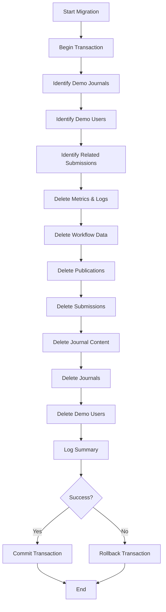

# Design Document: Production Database Cleanup

## Overview

This design specifies a Laravel database migration that removes all demo/seeded data from the production IAMJOS system while preserving essential system infrastructure. The migration transforms the system from a state containing 5 demo journals with associated data into a "Fresh OJS" state where administrators can create their first real journal.

The cleanup must handle complex foreign key relationships across 30+ tables, execute atomically within a database transaction, and provide comprehensive logging. The design ensures OJS compliance by preserving all application code, database structures, and Google Scholar indexing capabilities.

**Key Design Principles:**
- Atomic execution via database transactions
- Respect foreign key constraints through proper deletion order
- Preserve all system infrastructure (RBAC, templates, settings)
- Comprehensive logging for audit trail
- Safe rollback mechanism

## Architecture

### Migration Structure

The cleanup will be implemented as a single Laravel migration file:

**File:** `database/migrations/YYYY_MM_DD_HHMMSS_cleanup_production_demo_data.php`

**Class Structure:**
```php
class CleanupProductionDemoData extends Migration
{
    public function up(): void
    {
        // Main cleanup logic with transaction
    }
    
    public function down(): void
    {
        // Rollback guidance (non-destructive)
    }
    
    private function identifyDemoJournals(): Collection
    private function identifyDemoUsers(): Collection
    private function deleteMetricsAndLogs(Collection $journalIds, Collection $submissionIds): array
    private function deleteWorkflowData(Collection $submissionIds): array
    private function deletePublicationData(Collection $submissionIds): array
    private function deleteSubmissions(Collection $submissionIds): array
    private function deleteJournalContent(Collection $journalIds): array
    private function deleteJournals(Collection $journalIds): int
    private function deleteDemoUsers(Collection $userIds): int
    private function logCleanupSummary(array $counts): void
}
```


### Transaction Boundary

All deletion operations will execute within a single database transaction to ensure atomicity:

```php
DB::transaction(function () {
    // All deletion operations
});
```

If any operation fails, the entire migration rolls back automatically, leaving the database in its original state.

### Execution Flow



## Components and Interfaces

### 1. Identification Logic

**Purpose:** Identify all demo journals and users that need to be removed.

**Demo Journal Identification:**
- Match by slug values: `['jit', 'medika', 'jbe', 'eas', 'iamjos']`
- Return collection of journal IDs

**Demo User Identification:**
- Match by email pattern: `LIKE '%@demo.iamjos.id'`
- Exclude super admin (from `SUPER_ADMIN_EMAIL` env variable)
- Return collection of user IDs

**Implementation:**
```php
private function identifyDemoJournals(): Collection
{
    return DB::table('journals')
        ->whereIn('slug', ['jit', 'medika', 'jbe', 'eas', 'iamjos'])
        ->pluck('id');
}

private function identifyDemoUsers(): Collection
{
    $superAdminEmail = config('auth.super_admin_email');
    
    return DB::table('users')
        ->where('email', 'LIKE', '%@demo.iamjos.id')
        ->where('email', '!=', $superAdminEmail)
        ->pluck('id');
}
```


### 2. Deletion Order Strategy

**Critical Constraint:** Child records must be deleted before parent records to respect foreign key constraints.

**Deletion Sequence (7 Phases):**

1. **Phase 1: Metrics & Logs** (No foreign key dependencies)
   - `article_metrics`
   - `submission_logs`
   - `submission_log_files`
   - `submission_notes`
   - `crossref_logs`

2. **Phase 2: Workflow Data** (Depends on submissions)
   - `discussion_files`
   - `discussion_messages`
   - `discussion_participants`
   - `discussions`
   - `review_assignments`
   - `review_rounds`
   - `editorial_assignments`

3. **Phase 3: Publication Data** (Depends on submissions)
   - `publication_galleys`
   - `submission_authors` (where publication_id is not null)
   - `publications`

4. **Phase 4: Submission Data** (Depends on journals)
   - `submission_keyword` (pivot table)
   - `submission_files`
   - `submission_authors` (where submission_id is not null)
   - `submissions`

5. **Phase 5: Journal Content** (Depends on journals)
   - `navigation_items` (where menu belongs to journal)
   - `navigation_menus` (where journal_id is not null)
   - `sidebar_blocks` (where journal_id is not null)
   - `announcements`
   - `notification_templates` (where journal_id is not null)
   - `sections`
   - `issues`
   - `journal_settings`

6. **Phase 6: Journals**
   - `journals`

7. **Phase 7: Demo Users**
   - `journal_user_roles`
   - `model_has_roles` (Spatie permission pivot)
   - `users`

**Rationale:** This order ensures that no foreign key constraint violations occur. Each phase deletes records that only depend on entities deleted in later phases.


### 3. Deletion Methods

Each phase is implemented as a private method that returns deletion counts for logging.

**Phase 1: Metrics & Logs**
```php
private function deleteMetricsAndLogs(Collection $journalIds, Collection $submissionIds): array
{
    $counts = [];
    
    // Article metrics (by submission)
    $counts['article_metrics'] = DB::table('article_metrics')
        ->whereIn('submission_id', $submissionIds)
        ->delete();
    
    // Submission log files (via submission_logs)
    $logIds = DB::table('submission_logs')
        ->whereIn('submission_id', $submissionIds)
        ->pluck('id');
    
    $counts['submission_log_files'] = DB::table('submission_log_files')
        ->whereIn('submission_log_id', $logIds)
        ->delete();
    
    // Submission logs
    $counts['submission_logs'] = DB::table('submission_logs')
        ->whereIn('submission_id', $submissionIds)
        ->delete();
    
    // Submission notes
    $counts['submission_notes'] = DB::table('submission_notes')
        ->whereIn('submission_id', $submissionIds)
        ->delete();
    
    // Crossref logs
    $counts['crossref_logs'] = DB::table('crossref_logs')
        ->whereIn('journal_id', $journalIds)
        ->delete();
    
    return $counts;
}
```

**Phase 2: Workflow Data**
```php
private function deleteWorkflowData(Collection $submissionIds): array
{
    $counts = [];
    
    // Get discussion IDs first
    $discussionIds = DB::table('discussions')
        ->whereIn('submission_id', $submissionIds)
        ->pluck('id');
    
    // Discussion files
    $counts['discussion_files'] = DB::table('discussion_files')
        ->whereIn('discussion_id', $discussionIds)
        ->delete();
    
    // Discussion messages
    $counts['discussion_messages'] = DB::table('discussion_messages')
        ->whereIn('discussion_id', $discussionIds)
        ->delete();
    
    // Discussion participants
    $counts['discussion_participants'] = DB::table('discussion_participants')
        ->whereIn('discussion_id', $discussionIds)
        ->delete();
    
    // Discussions
    $counts['discussions'] = DB::table('discussions')
        ->whereIn('submission_id', $submissionIds)
        ->delete();
    
    // Review assignments
    $counts['review_assignments'] = DB::table('review_assignments')
        ->whereIn('submission_id', $submissionIds)
        ->delete();
    
    // Review rounds
    $counts['review_rounds'] = DB::table('review_rounds')
        ->whereIn('submission_id', $submissionIds)
        ->delete();
    
    // Editorial assignments
    $counts['editorial_assignments'] = DB::table('editorial_assignments')
        ->whereIn('submission_id', $submissionIds)
        ->delete();
    
    return $counts;
}
```


**Phase 3: Publication Data**
```php
private function deletePublicationData(Collection $submissionIds): array
{
    $counts = [];
    
    // Get publication IDs
    $publicationIds = DB::table('publications')
        ->whereIn('submission_id', $submissionIds)
        ->pluck('id');
    
    // Publication galleys
    $counts['publication_galleys'] = DB::table('publication_galleys')
        ->whereIn('publication_id', $publicationIds)
        ->delete();
    
    // Submission authors linked to publications
    $counts['submission_authors_pub'] = DB::table('submission_authors')
        ->whereIn('publication_id', $publicationIds)
        ->delete();
    
    // Publications
    $counts['publications'] = DB::table('publications')
        ->whereIn('submission_id', $submissionIds)
        ->delete();
    
    return $counts;
}
```

**Phase 4: Submission Data**
```php
private function deleteSubmissions(Collection $submissionIds): array
{
    $counts = [];
    
    // Submission-keyword pivot
    $counts['submission_keyword'] = DB::table('submission_keyword')
        ->whereIn('submission_id', $submissionIds)
        ->delete();
    
    // Submission files
    $counts['submission_files'] = DB::table('submission_files')
        ->whereIn('submission_id', $submissionIds)
        ->delete();
    
    // Remaining submission authors (not linked to publications)
    $counts['submission_authors'] = DB::table('submission_authors')
        ->whereIn('submission_id', $submissionIds)
        ->whereNull('publication_id')
        ->delete();
    
    // Submissions
    $counts['submissions'] = DB::table('submissions')
        ->whereIn('id', $submissionIds)
        ->delete();
    
    return $counts;
}
```


**Phase 5: Journal Content**
```php
private function deleteJournalContent(Collection $journalIds): array
{
    $counts = [];
    
    // Get navigation menu IDs for these journals
    $menuIds = DB::table('navigation_menus')
        ->whereIn('journal_id', $journalIds)
        ->pluck('id');
    
    // Navigation items
    $counts['navigation_items'] = DB::table('navigation_items')
        ->whereIn('navigation_menu_id', $menuIds)
        ->delete();
    
    // Navigation menus
    $counts['navigation_menus'] = DB::table('navigation_menus')
        ->whereIn('journal_id', $journalIds)
        ->delete();
    
    // Sidebar blocks
    $counts['sidebar_blocks'] = DB::table('sidebar_blocks')
        ->whereIn('journal_id', $journalIds)
        ->delete();
    
    // Announcements
    $counts['announcements'] = DB::table('announcements')
        ->whereIn('journal_id', $journalIds)
        ->delete();
    
    // Notification templates (journal-specific)
    $counts['notification_templates'] = DB::table('notification_templates')
        ->whereIn('journal_id', $journalIds)
        ->delete();
    
    // Sections
    $counts['sections'] = DB::table('sections')
        ->whereIn('journal_id', $journalIds)
        ->delete();
    
    // Issues
    $counts['issues'] = DB::table('issues')
        ->whereIn('journal_id', $journalIds)
        ->delete();
    
    // Journal settings
    $counts['journal_settings'] = DB::table('journal_settings')
        ->whereIn('journal_id', $journalIds)
        ->delete();
    
    return $counts;
}
```

**Phase 6: Journals**
```php
private function deleteJournals(Collection $journalIds): int
{
    return DB::table('journals')
        ->whereIn('id', $journalIds)
        ->delete();
}
```

**Phase 7: Demo Users**
```php
private function deleteDemoUsers(Collection $userIds): int
{
    // Journal user roles
    DB::table('journal_user_roles')
        ->whereIn('user_id', $userIds)
        ->delete();
    
    // Spatie permission roles
    DB::table('model_has_roles')
        ->where('model_type', 'App\\Models\\User')
        ->whereIn('model_id', $userIds)
        ->delete();
    
    // Users
    return DB::table('users')
        ->whereIn('id', $userIds)
        ->delete();
}
```


## Data Models

### Demo Journal Identification

**Criteria:**
- Slug matches one of: `['jit', 'medika', 'jbe', 'eas', 'iamjos']`

**Data Structure:**
```php
Collection<string> // Collection of journal UUIDs
```

### Demo User Identification

**Criteria:**
- Email matches pattern: `%@demo.iamjos.id`
- Email does NOT match super admin email from config

**Data Structure:**
```php
Collection<string> // Collection of user UUIDs
```

### Deletion Count Tracking

**Structure:**
```php
[
    'article_metrics' => int,
    'submission_logs' => int,
    'submission_log_files' => int,
    'submission_notes' => int,
    'crossref_logs' => int,
    'discussion_files' => int,
    'discussion_messages' => int,
    'discussion_participants' => int,
    'discussions' => int,
    'review_assignments' => int,
    'review_rounds' => int,
    'editorial_assignments' => int,
    'publication_galleys' => int,
    'submission_authors_pub' => int,
    'publications' => int,
    'submission_keyword' => int,
    'submission_files' => int,
    'submission_authors' => int,
    'submissions' => int,
    'navigation_items' => int,
    'navigation_menus' => int,
    'sidebar_blocks' => int,
    'announcements' => int,
    'notification_templates' => int,
    'sections' => int,
    'issues' => int,
    'journal_settings' => int,
    'journals' => int,
    'users' => int,
]
```


## Correctness Properties

*A property is a characteristic or behavior that should hold true across all valid executions of a system—essentially, a formal statement about what the system should do. Properties serve as the bridge between human-readable specifications and machine-verifiable correctness guarantees.*

### Property Reflection

After analyzing all acceptance criteria, several patterns emerged:

**Redundancy Analysis:**
- Requirements 1.1-1.4, 2.1-2.6, 3.1-3.7, 5.1-5.5, 6.1-6.5 all test the same pattern: "verify specific table has zero records for demo entities"
- These can be consolidated into a single comprehensive property: "Fresh OJS State Verification"
- Requirements 7.1-7.10 and 8.1-8.3 test preservation, which is the inverse: "verify specific tables retain their records"
- These can be consolidated into: "System Infrastructure Preservation"
- Requirements 11.x and 12.x verify code/structure preservation, which is covered by "No Schema Modification"

**Consolidated Properties:**
1. **Fresh OJS State** - Comprehensive verification that all demo data is removed
2. **System Infrastructure Preservation** - Verification that essential infrastructure remains
3. **Transaction Atomicity** - Verification that failures roll back completely
4. **Super Admin Preservation** - Verification that super admin is never deleted
5. **No Schema Modification** - Verification that database structure is unchanged


### Property 1: Fresh OJS State Verification

*For any* database state after successful migration execution, the system SHALL have zero demo journals, zero demo submissions, zero demo users, and zero related demo data across all dependent tables.

**Validates: Requirements 1.1, 1.2, 1.3, 1.4, 2.1, 2.2, 2.3, 2.4, 2.5, 2.6, 3.1, 3.2, 3.3, 3.4, 3.5, 3.6, 3.7, 4.1, 5.1, 5.2, 5.3, 5.4, 5.5, 6.1, 6.2, 6.3, 6.4, 6.5, 13.1, 13.2, 13.3**

**Verification Method:**
```php
// After migration runs
$demoJournalCount = DB::table('journals')
    ->whereIn('slug', ['jit', 'medika', 'jbe', 'eas', 'iamjos'])
    ->count();

$demoUserCount = DB::table('users')
    ->where('email', 'LIKE', '%@demo.iamjos.id')
    ->where('email', '!=', config('auth.super_admin_email'))
    ->count();

$submissionCount = DB::table('submissions')->count();
$publicationCount = DB::table('publications')->count();
$sectionCount = DB::table('sections')->count();
$issueCount = DB::table('issues')->count();

assert($demoJournalCount === 0);
assert($demoUserCount === 0);
assert($submissionCount === 0);
assert($publicationCount === 0);
assert($sectionCount === 0);
assert($issueCount === 0);
```

### Property 2: System Infrastructure Preservation

*For any* database state after migration execution, all system infrastructure tables (roles, permissions, email templates, site settings, site content, site-level navigation) SHALL retain their pre-migration record counts.

**Validates: Requirements 7.1, 7.2, 7.3, 7.4, 7.5, 7.6, 7.7, 7.8, 7.9, 8.1, 8.2, 8.3, 13.5**

**Verification Method:**
```php
// Before migration
$beforeCounts = [
    'roles' => DB::table('roles')->count(),
    'permissions' => DB::table('permissions')->count(),
    'role_has_permissions' => DB::table('role_has_permissions')->count(),
    'email_templates' => DB::table('email_templates')->count(),
    'site_settings' => DB::table('site_settings')->count(),
    'site_contents' => DB::table('site_contents')->count(),
    'site_content_blocks' => DB::table('site_content_blocks')->count(),
    'site_pages' => DB::table('site_pages')->count(),
    'site_navigation_menus' => DB::table('navigation_menus')->whereNull('journal_id')->count(),
    'site_navigation_items' => DB::table('navigation_items')
        ->whereIn('navigation_menu_id', DB::table('navigation_menus')->whereNull('journal_id')->pluck('id'))
        ->count(),
];

// After migration
$afterCounts = [ /* same queries */ ];

assert($beforeCounts === $afterCounts);
```


### Property 3: Transaction Atomicity

*For any* migration execution that encounters an error during deletion operations, the database SHALL roll back all changes and return to its pre-migration state with zero records modified.

**Validates: Requirements 9.4, 9.5**

**Verification Method:**
```php
// Capture initial state
$initialJournalCount = DB::table('journals')->count();
$initialUserCount = DB::table('users')->count();
$initialSubmissionCount = DB::table('submissions')->count();

// Simulate failure by injecting an error mid-migration
try {
    DB::transaction(function () {
        // ... deletion operations ...
        throw new \Exception('Simulated failure');
    });
} catch (\Exception $e) {
    // Verify rollback
    $afterJournalCount = DB::table('journals')->count();
    $afterUserCount = DB::table('users')->count();
    $afterSubmissionCount = DB::table('submissions')->count();
    
    assert($initialJournalCount === $afterJournalCount);
    assert($initialUserCount === $afterUserCount);
    assert($initialSubmissionCount === $afterSubmissionCount);
}
```

### Property 4: Super Admin Preservation

*For any* migration execution, the user account matching the `SUPER_ADMIN_EMAIL` configuration SHALL remain in the users table with all associated roles and permissions intact.

**Validates: Requirements 4.3, 7.10, 13.4**

**Verification Method:**
```php
$superAdminEmail = config('auth.super_admin_email');

// Before migration
$superAdminBefore = DB::table('users')->where('email', $superAdminEmail)->first();
$rolesBefore = DB::table('model_has_roles')
    ->where('model_type', 'App\\Models\\User')
    ->where('model_id', $superAdminBefore->id)
    ->pluck('role_id');

// After migration
$superAdminAfter = DB::table('users')->where('email', $superAdminEmail)->first();
$rolesAfter = DB::table('model_has_roles')
    ->where('model_type', 'App\\Models\\User')
    ->where('model_id', $superAdminAfter->id)
    ->pluck('role_id');

assert($superAdminAfter !== null);
assert($superAdminBefore->id === $superAdminAfter->id);
assert($rolesBefore->toArray() === $rolesAfter->toArray());
```


### Property 5: No Schema Modification

*For any* migration execution, all database table structures, indexes, foreign key constraints, and column definitions SHALL remain identical to their pre-migration state.

**Validates: Requirements 11.1, 11.2, 11.3, 11.4, 11.5, 11.6, 11.7, 12.1, 12.2, 12.3, 12.4, 12.5, 12.6**

**Verification Method:**
```php
// Before migration
$beforeSchema = DB::select("
    SELECT table_name, column_name, data_type, is_nullable, column_default
    FROM information_schema.columns
    WHERE table_schema = 'public'
    ORDER BY table_name, ordinal_position
");

$beforeIndexes = DB::select("
    SELECT tablename, indexname, indexdef
    FROM pg_indexes
    WHERE schemaname = 'public'
    ORDER BY tablename, indexname
");

$beforeConstraints = DB::select("
    SELECT conname, contype, conrelid::regclass AS table_name
    FROM pg_constraint
    WHERE connamespace = 'public'::regnamespace
    ORDER BY conname
");

// After migration
$afterSchema = [ /* same query */ ];
$afterIndexes = [ /* same query */ ];
$afterConstraints = [ /* same query */ ];

assert($beforeSchema === $afterSchema);
assert($beforeIndexes === $afterIndexes);
assert($beforeConstraints === $afterConstraints);
```


## Error Handling

### Transaction Failure

**Scenario:** Any deletion operation fails due to database error, constraint violation, or unexpected state.

**Handling:**
1. Laravel's `DB::transaction()` automatically rolls back all changes
2. Exception is propagated to migration runner
3. Migration status remains "not migrated"
4. Database returns to pre-migration state

**Implementation:**
```php
public function up(): void
{
    try {
        DB::transaction(function () {
            // All deletion operations
        });
        
        $this->logCleanupSummary($counts);
    } catch (\Exception $e) {
        Log::error('Production cleanup migration failed', [
            'error' => $e->getMessage(),
            'trace' => $e->getTraceAsString(),
        ]);
        
        throw $e; // Re-throw to mark migration as failed
    }
}
```

### Missing Configuration

**Scenario:** `SUPER_ADMIN_EMAIL` is not configured in environment.

**Handling:**
1. Migration checks for configuration at start
2. If missing, throws descriptive exception
3. No deletion operations execute

**Implementation:**
```php
public function up(): void
{
    $superAdminEmail = config('auth.super_admin_email');
    
    if (empty($superAdminEmail)) {
        throw new \RuntimeException(
            'SUPER_ADMIN_EMAIL must be configured before running cleanup migration. ' .
            'Set this in your .env file to protect the super admin account.'
        );
    }
    
    // Continue with migration...
}
```

### No Demo Data Found

**Scenario:** Migration runs but no demo journals or users exist.

**Handling:**
1. Migration executes normally
2. All deletion operations return zero counts
3. Migration completes successfully
4. Log message indicates "No demo data found"

**Implementation:**
```php
if ($journalIds->isEmpty() && $userIds->isEmpty()) {
    Log::info('Production cleanup: No demo data found to remove');
    return;
}
```


### Orphaned Keywords

**Scenario:** After deleting submission_keyword pivot records, some keywords may have zero submissions.

**Handling:**
1. This is acceptable - keywords table is a shared resource
2. Orphaned keywords do not cause errors
3. Future submissions can reuse existing keywords
4. Optional cleanup can be added later if needed

**Rationale:** Keywords are lightweight and may be reused by future submissions. Deleting them adds complexity without significant benefit.

## Testing Strategy

### Dual Testing Approach

The migration will be validated using both unit tests and property-based tests:

**Unit Tests:**
- Test identification logic with specific demo data
- Test each deletion phase independently
- Test error handling scenarios (missing config, transaction failure)
- Test rollback behavior
- Test logging output

**Property-Based Tests:**
- Verify Fresh OJS State property across multiple test runs
- Verify System Infrastructure Preservation with varying initial states
- Verify Transaction Atomicity with simulated failures
- Verify Super Admin Preservation with different admin configurations
- Verify No Schema Modification

### Test Configuration

**Property-Based Testing Library:** Laravel's built-in testing with custom property test helpers

**Test Iterations:** Minimum 100 iterations per property test

**Test Tagging:** Each property test includes a comment:
```php
/**
 * Feature: production-database-cleanup, Property 1: Fresh OJS State Verification
 */
public function test_fresh_ojs_state_after_cleanup(): void
{
    // Property test implementation
}
```


### Unit Test Coverage

**Test File:** `tests/Feature/Migrations/CleanupProductionDemoDataTest.php`

**Test Cases:**

1. **test_identifies_demo_journals_correctly()**
   - Seeds demo journals with known slugs
   - Calls identification method
   - Asserts correct journal IDs returned

2. **test_identifies_demo_users_correctly()**
   - Seeds demo users with @demo.iamjos.id emails
   - Seeds super admin
   - Calls identification method
   - Asserts demo users found, super admin excluded

3. **test_deletes_all_demo_data()**
   - Seeds complete demo dataset
   - Runs migration
   - Asserts all demo data removed
   - Asserts infrastructure preserved

4. **test_preserves_super_admin()**
   - Seeds super admin and demo users
   - Runs migration
   - Asserts super admin still exists with roles

5. **test_transaction_rollback_on_failure()**
   - Seeds demo data
   - Mocks database error mid-migration
   - Asserts no data was deleted

6. **test_handles_missing_super_admin_config()**
   - Clears SUPER_ADMIN_EMAIL config
   - Attempts migration
   - Asserts exception thrown

7. **test_handles_no_demo_data_gracefully()**
   - Runs migration on clean database
   - Asserts no errors
   - Asserts log message indicates no data found

8. **test_logs_deletion_counts()**
   - Seeds demo data
   - Runs migration
   - Asserts log contains counts for each table

9. **test_down_method_displays_warning()**
   - Calls down() method
   - Asserts warning message displayed
   - Asserts no destructive operations performed


### Property Test Coverage

**Test File:** `tests/Feature/Migrations/CleanupProductionDemoDataPropertyTest.php`

**Property Tests:**

1. **test_property_fresh_ojs_state()**
   - Generates random demo data configurations
   - Runs migration
   - Verifies zero demo journals, users, submissions
   - Runs 100 iterations with different data sets

2. **test_property_infrastructure_preservation()**
   - Captures infrastructure counts before migration
   - Runs migration
   - Verifies all infrastructure counts unchanged
   - Runs 100 iterations

3. **test_property_transaction_atomicity()**
   - Simulates random failure points
   - Verifies complete rollback
   - Runs 100 iterations with different failure scenarios

4. **test_property_super_admin_preservation()**
   - Tests with different super admin configurations
   - Verifies super admin always preserved
   - Runs 100 iterations

5. **test_property_no_schema_modification()**
   - Captures schema before migration
   - Runs migration
   - Verifies schema unchanged
   - Runs 100 iterations

## Logging Strategy

### Log Levels

**INFO:** Normal operation progress
- "Starting production demo data cleanup"
- "Identified X demo journals"
- "Identified X demo users"
- "Phase 1: Deleted X metrics and logs"
- "Cleanup completed successfully"

**WARNING:** Non-critical issues
- "No demo data found to remove"

**ERROR:** Critical failures
- "Production cleanup migration failed: {error message}"
- "SUPER_ADMIN_EMAIL not configured"


### Log Output Format

**Console Output (via Artisan):**
```
🧹 Starting production demo data cleanup...

📊 Identification Phase:
   ✓ Found 5 demo journals
   ✓ Found 4 demo users
   ✓ Found 127 submissions to remove

🗑️  Phase 1: Metrics & Logs
   ✓ Deleted 1,234 article_metrics
   ✓ Deleted 567 submission_logs
   ✓ Deleted 89 submission_log_files
   ✓ Deleted 45 submission_notes
   ✓ Deleted 23 crossref_logs

🗑️  Phase 2: Workflow Data
   ✓ Deleted 12 discussion_files
   ✓ Deleted 34 discussion_messages
   ✓ Deleted 56 discussion_participants
   ✓ Deleted 15 discussions
   ✓ Deleted 78 review_assignments
   ✓ Deleted 45 review_rounds
   ✓ Deleted 23 editorial_assignments

🗑️  Phase 3: Publication Data
   ✓ Deleted 234 publication_galleys
   ✓ Deleted 456 submission_authors (publications)
   ✓ Deleted 127 publications

🗑️  Phase 4: Submission Data
   ✓ Deleted 345 submission_keyword pivots
   ✓ Deleted 678 submission_files
   ✓ Deleted 123 submission_authors
   ✓ Deleted 127 submissions

🗑️  Phase 5: Journal Content
   ✓ Deleted 45 navigation_items
   ✓ Deleted 10 navigation_menus
   ✓ Deleted 15 sidebar_blocks
   ✓ Deleted 8 announcements
   ✓ Deleted 12 notification_templates
   ✓ Deleted 20 sections
   ✓ Deleted 15 issues
   ✓ Deleted 5 journal_settings

🗑️  Phase 6: Journals
   ✓ Deleted 5 journals

🗑️  Phase 7: Demo Users
   ✓ Deleted 4 users

✅ Production cleanup completed successfully!
   Total records removed: 4,321
   Super admin preserved: admin@example.com
   System infrastructure: Intact
```

**Log File Output (storage/logs/laravel.log):**
```
[2026-06-15 10:30:00] production.INFO: Starting production demo data cleanup
[2026-06-15 10:30:01] production.INFO: Identified demo journals {"count":5,"slugs":["jit","medika","jbe","eas","iamjos"]}
[2026-06-15 10:30:01] production.INFO: Identified demo users {"count":4}
[2026-06-15 10:30:02] production.INFO: Phase 1 complete {"article_metrics":1234,"submission_logs":567,...}
[2026-06-15 10:30:03] production.INFO: Phase 2 complete {"discussions":15,"review_assignments":78,...}
[2026-06-15 10:30:04] production.INFO: Phase 3 complete {"publications":127,"publication_galleys":234,...}
[2026-06-15 10:30:05] production.INFO: Phase 4 complete {"submissions":127,"submission_files":678,...}
[2026-06-15 10:30:06] production.INFO: Phase 5 complete {"sections":20,"issues":15,...}
[2026-06-15 10:30:07] production.INFO: Phase 6 complete {"journals":5}
[2026-06-15 10:30:08] production.INFO: Phase 7 complete {"users":4}
[2026-06-15 10:30:08] production.INFO: Cleanup completed {"total_records":4321,"duration_seconds":8}
```


### Logging Implementation

```php
private function logCleanupSummary(array $counts): void
{
    $totalRecords = array_sum($counts);
    
    Log::info('Production cleanup completed', [
        'total_records' => $totalRecords,
        'breakdown' => $counts,
        'super_admin_preserved' => config('auth.super_admin_email'),
    ]);
    
    // Console output
    $this->command->newLine();
    $this->command->info('✅ Production cleanup completed successfully!');
    $this->command->info("   Total records removed: {$totalRecords}");
    $this->command->info('   Super admin preserved: ' . config('auth.super_admin_email'));
    $this->command->info('   System infrastructure: Intact');
    $this->command->newLine();
}
```

## Rollback Design

### down() Method Implementation

The `down()` method does NOT attempt to restore deleted data. Instead, it provides guidance for manual restoration.

**Rationale:**
- Deleted data cannot be reliably reconstructed
- Attempting restoration could create inconsistent state
- Manual seeding via DemoSeeder is safer and more predictable

**Implementation:**
```php
public function down(): void
{
    Log::warning('Production cleanup rollback requested');
    
    $this->command->newLine();
    $this->command->warn('⚠️  ROLLBACK WARNING');
    $this->command->warn('');
    $this->command->warn('This migration removed demo data from production.');
    $this->command->warn('Deleted data CANNOT be automatically restored.');
    $this->command->warn('');
    $this->command->info('To restore demo data:');
    $this->command->info('  1. Ensure APP_ENV is set to "local" or "staging"');
    $this->command->info('  2. Run: php artisan db:seed --class=DemoSeeder');
    $this->command->warn('');
    $this->command->warn('⚠️  DO NOT run DemoSeeder in production!');
    $this->command->newLine();
}
```

### Rollback Behavior

**When `php artisan migrate:rollback` is executed:**
1. Laravel calls the `down()` method
2. Warning message is displayed
3. Instructions for manual restoration are shown
4. Migration is marked as "not migrated"
5. No database changes occur

**Idempotency:** The `down()` method can be called multiple times safely - it only displays messages.


## DemoSeeder Production Guard

### Implementation

The DemoSeeder already includes a production guard (implemented in requirements). This design documents its behavior for completeness.

**Location:** `database/seeders/DemoSeeder.php`

**Guard Logic:**
```php
public function run(): void
{
    if (app()->isProduction()) {
        $this->command->error('❌ DemoSeeder REFUSED: Cannot run in production environment.');
        $this->command->error('   Set APP_ENV=local or APP_ENV=staging to use demo data.');
        return;
    }
    
    // Continue with seeding...
}
```

**Behavior:**
- Checks `app()->isProduction()` before any operations
- If production, displays error and returns immediately
- No database operations execute
- Exit code is 0 (not a failure, intentional refusal)

**Testing:**
```php
public function test_demo_seeder_refuses_production(): void
{
    app()->detectEnvironment(fn() => 'production');
    
    $this->artisan('db:seed', ['--class' => 'DemoSeeder'])
        ->expectsOutput('❌ DemoSeeder REFUSED: Cannot run in production environment.')
        ->assertExitCode(0);
    
    // Verify no journals were created
    $this->assertDatabaseCount('journals', 0);
}
```

## Migration Execution Checklist

### Pre-Execution

- [ ] Verify `SUPER_ADMIN_EMAIL` is configured in `.env`
- [ ] Verify super admin user exists in database
- [ ] Create database backup
- [ ] Verify application is in maintenance mode (optional but recommended)
- [ ] Review migration code for correctness

### Execution

```bash
# Run migration
php artisan migrate

# Verify success
php artisan migrate:status
```

### Post-Execution Verification

- [ ] Check migration status shows as "Ran"
- [ ] Verify zero journals: `SELECT COUNT(*) FROM journals;`
- [ ] Verify zero submissions: `SELECT COUNT(*) FROM submissions;`
- [ ] Verify zero demo users: `SELECT COUNT(*) FROM users WHERE email LIKE '%@demo.iamjos.id';`
- [ ] Verify super admin exists: `SELECT * FROM users WHERE email = '{SUPER_ADMIN_EMAIL}';`
- [ ] Verify infrastructure intact: Check roles, permissions, site_settings counts
- [ ] Review log file for any warnings or errors
- [ ] Test creating a new journal via admin interface


## Performance Considerations

### Deletion Performance

**Expected Volume:**
- 5 demo journals
- ~20 sections
- ~15 issues
- ~127 submissions (estimated)
- ~127 publications
- ~500 submission files
- ~1,000+ metrics records
- 4 demo users

**Estimated Execution Time:** 5-15 seconds

**Optimization Strategies:**
1. Use `whereIn()` with collected IDs for batch deletions
2. Execute within single transaction (reduces commit overhead)
3. Delete in proper order to avoid constraint checks
4. Use `DB::table()` instead of Eloquent for performance

### Index Usage

All deletion queries use indexed columns:
- `journal_id` (indexed in all journal-related tables)
- `submission_id` (indexed in all submission-related tables)
- `user_id` (indexed in user-related tables)
- `email` (indexed in users table)
- `slug` (indexed in journals table)

### Memory Usage

**Memory Footprint:** Low
- Collections of IDs are small (< 1KB)
- No large data loading into memory
- Deletion operations stream to database

**No Risk of Memory Exhaustion:** All operations use database-level deletions, not Eloquent model loading.

## Security Considerations

### Super Admin Protection

**Multiple Safeguards:**
1. Explicit exclusion in user identification query
2. Configuration validation before execution
3. Post-execution verification in tests

**Configuration Source:** `config('auth.super_admin_email')` from `.env` file

### Audit Trail

**Complete Logging:**
- All deletion counts logged
- Super admin preservation logged
- Execution time logged
- Any errors logged with full context

**Log Retention:** Follows Laravel's standard log rotation policy

### Transaction Isolation

**ACID Compliance:**
- **Atomicity:** All-or-nothing execution via transaction
- **Consistency:** Foreign key constraints enforced
- **Isolation:** Default PostgreSQL isolation level (Read Committed)
- **Durability:** Changes committed to disk after transaction


## OJS and Google Scholar Compliance

### OJS Compliance Preservation

**What is NOT Modified:**
- All database table structures
- All database indexes
- All database foreign key constraints
- All application code (controllers, models, services)
- All workflow logic (submission, review, editorial, publication)
- All business rules and validation

**What IS Modified:**
- Data records only (journals, users, submissions, etc.)

**Compliance Verification:**
- Schema comparison before/after (Property 5)
- Application code remains unchanged
- All OJS workflow features remain functional
- New journals can be created and follow standard OJS workflow

### Google Scholar Compliance Preservation

**Preserved Capabilities:**
- Meta tag generation code (unchanged)
- Highwire Press tags implementation (unchanged)
- Dublin Core metadata generation (unchanged)
- Citation metadata formatting (unchanged)
- OAI-PMH endpoints (unchanged)
- JSON-LD structured data (unchanged)

**Impact on Indexing:**
- No impact - all code remains functional
- Future published articles will be indexed normally
- Meta tags will be generated for new publications
- Google Scholar crawler will find proper metadata

**Verification:**
- Application code review (no changes)
- Test publication creation after cleanup
- Verify meta tags generated correctly

## Dependencies

### Laravel Framework

**Required Version:** Laravel 11.x
**Required Features:**
- Database migrations
- Query builder
- Transaction support
- Logging facade
- Configuration system

### Database

**Required:** PostgreSQL 14+
**Required Features:**
- Transaction support
- Foreign key constraints
- UUID support
- JSONB support

### Configuration

**Required Environment Variables:**
- `SUPER_ADMIN_EMAIL` - Email of super admin to preserve

**Optional Environment Variables:**
- `DB_CONNECTION` - Database connection (default: pgsql)
- `LOG_CHANNEL` - Log channel (default: stack)


## Migration File Structure

### Complete File Template

```php
<?php

use Illuminate\Database\Migrations\Migration;
use Illuminate\Support\Facades\DB;
use Illuminate\Support\Facades\Log;
use Illuminate\Support\Collection;

return new class extends Migration
{
    /**
     * Run the migrations.
     * 
     * Removes all demo/seeded data from production while preserving
     * system infrastructure and super admin account.
     */
    public function up(): void
    {
        // Validate configuration
        $superAdminEmail = config('auth.super_admin_email');
        if (empty($superAdminEmail)) {
            throw new \RuntimeException(
                'SUPER_ADMIN_EMAIL must be configured before running cleanup migration.'
            );
        }
        
        Log::info('Starting production demo data cleanup');
        
        try {
            DB::transaction(function () use ($superAdminEmail) {
                // Phase 0: Identification
                $journalIds = $this->identifyDemoJournals();
                $userIds = $this->identifyDemoUsers();
                
                if ($journalIds->isEmpty() && $userIds->isEmpty()) {
                    Log::info('No demo data found to remove');
                    return;
                }
                
                // Get submission IDs for cascade deletions
                $submissionIds = DB::table('submissions')
                    ->whereIn('journal_id', $journalIds)
                    ->pluck('id');
                
                Log::info('Identified demo data', [
                    'journals' => $journalIds->count(),
                    'users' => $userIds->count(),
                    'submissions' => $submissionIds->count(),
                ]);
                
                // Phase 1-7: Deletions
                $counts = [];
                $counts = array_merge($counts, $this->deleteMetricsAndLogs($journalIds, $submissionIds));
                $counts = array_merge($counts, $this->deleteWorkflowData($submissionIds));
                $counts = array_merge($counts, $this->deletePublicationData($submissionIds));
                $counts = array_merge($counts, $this->deleteSubmissions($submissionIds));
                $counts = array_merge($counts, $this->deleteJournalContent($journalIds));
                $counts['journals'] = $this->deleteJournals($journalIds);
                $counts['users'] = $this->deleteDemoUsers($userIds);
                
                $this->logCleanupSummary($counts);
            });
        } catch (\Exception $e) {
            Log::error('Production cleanup migration failed', [
                'error' => $e->getMessage(),
                'trace' => $e->getTraceAsString(),
            ]);
            throw $e;
        }
    }
    
    /**
     * Reverse the migrations.
     * 
     * Note: This does NOT restore deleted data.
     * Use DemoSeeder to recreate demo data in non-production environments.
     */
    public function down(): void
    {
        Log::warning('Production cleanup rollback requested');
        
        $this->command->newLine();
        $this->command->warn('⚠️  ROLLBACK WARNING');
        $this->command->warn('');
        $this->command->warn('This migration removed demo data from production.');
        $this->command->warn('Deleted data CANNOT be automatically restored.');
        $this->command->warn('');
        $this->command->info('To restore demo data:');
        $this->command->info('  1. Ensure APP_ENV is set to "local" or "staging"');
        $this->command->info('  2. Run: php artisan db:seed --class=DemoSeeder');
        $this->command->warn('');
        $this->command->warn('⚠️  DO NOT run DemoSeeder in production!');
        $this->command->newLine();
    }
    
    // Private methods: identifyDemoJournals, identifyDemoUsers,
    // deleteMetricsAndLogs, deleteWorkflowData, deletePublicationData,
    // deleteSubmissions, deleteJournalContent, deleteJournals,
    // deleteDemoUsers, logCleanupSummary
    // (Implementations provided in Components and Interfaces section)
};
```

## Summary

This design provides a comprehensive, safe, and auditable approach to removing demo data from production. The migration:

1. **Executes atomically** via database transactions
2. **Respects foreign key constraints** through proper deletion order
3. **Preserves critical data** (super admin, system infrastructure)
4. **Provides comprehensive logging** for audit trail
5. **Handles errors gracefully** with automatic rollback
6. **Maintains OJS compliance** by preserving all code and structures
7. **Supports testing** via property-based and unit tests
8. **Offers safe rollback** with clear guidance for restoration

The implementation follows Laravel best practices and ensures the IAMJOS system transitions cleanly from a demo state to a production-ready "Fresh OJS" state.

